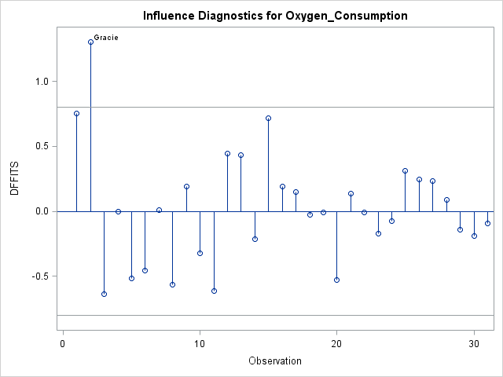
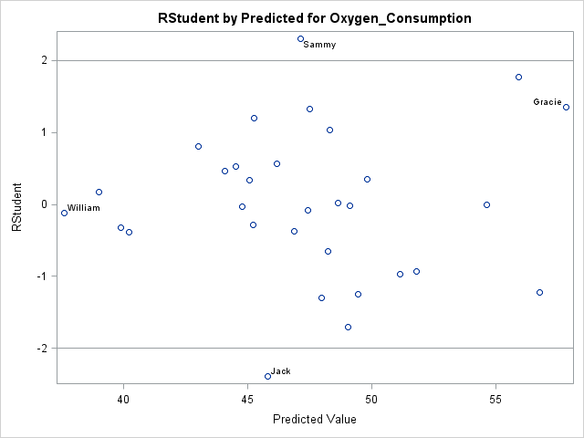

##Exam Review

### Index

* [ANOVA](#anova)
  * [ANOVA Assumptions](#anova-assumptions)
  * [One-way ANOVA](#one-way-anova)
  * [Two-way ANOVA with Interactions](#two-way-anova-with-interactions)
* [Assumptions for Linear Regression](#assumptions-for-linear-regression)
* [Best Practices Section](#best-practices)
* [Blocking](#randomized-complete-block-designs)
* [Categorical Data Analysis](#categorical-data-analysis)
  * [Odds Ratios](#odds-ratios)
  * [Tests of Association](#tests-for-association)
  * [Tests for Strength of Association](#tests-for-strength-of-association)
* [Comparisonwise Error Rate vs. Experimentwise Error Rate](#comparisonwise-error-rate-vs-experimentwise-error-rate)
* [Condition Index](#multicollinearity-diagnostics)
* [Conservative Significance Levels](#conservative-significance-levels)
* [Controlled Experiments](#controlled-experiments)
* [Dunnett Comparison Method](#special-case---dunnet)
* [Effects Coding vs. Reference Coding](#effects-coding)
* [Exploratory Data Analysis](#exploratory-data-analysis)
* [Identifying Influential Observations](#identifying-influential-observations)
  * [Cutoff Values for Influential Observations](#identifying-influential-observations-cutoff-values)
  * [Identifying Influential Observations with `PROC REG`](#identifying-influential-observations)
* [Logistic Regression](#logistic-regression-p5-45-book-1)
* [Multiple Linear Regression](#multiple-linear-regression)
* [Multiple Logistic Regression](#multiple-logistic-regression)
* [Multiple Polynomial Regression](#multiple-polynomial-regression)
* [Post-Hoc Testing](#post-hoc-testing)
* [Regression Diagnostics and Remedial Measures](#regression-diagnostic-and-remedial-measures)
  * [Evaluate Independence Assumption](#evaluate-model-assumptions-independence)
  * [Evaluate Normality Assumption](#evaluate-model-assumptions-normality)
  * [Evaluate Constant Variance Assumption](#evaluate-model-assumptions-constant-variance)
  * [Evaluate Model Fit](#evaluate-model-fit)
  * [Evaluate Multicollinearity](#evaluate-multicollinarity)
  * [Evaluate Influential Observations and Outliers](#evaluate-influential-observations-and-outliers)
    * [Cutoff Values for Influential Observations](#identifying-influential-observations-cutoff-values)
* [SAS Procedures Section](#sas-procedures)
  * [`PROC CORR`](#the-proc-corr-procedure)
  * [`PROC GLM`](#the-proc-glm-procedure)
  * [`PROC LOGISTIC`](#the-proc-logistic-procedure)
  * [`PROC MEANS`](#the-proc-means-procedure)
  * [`PROC REG`](#the-proc-reg-procedure)
  * [`PROC SCORE`](#the-proc-score-procedure)
  * [`PROC SGPLOT`](#the-proc-sgplot-procedure)
  * [`PROC SGSCATTER`](#the-proc-sgscatter-procedure)
  * [`PROC STDIZE`](#the-proc-stdize-procedure)
  * [`PROC TTEST`](#the-proc-ttest-procedure)
  * [`PROC UNIVARIATE`](#the-proc-univariate-procedure)
* [Simple Linear Regression](#simple-linear-regression)
* [Simple Polynomial Regression](#simple-polynomial-regression)
* [Table of Tests](#tests)
* [Terms and Definitions](#terms)
* [Tests for Normality](#normality)
  * [Testing Residuals for Normality](#testing-the-residuals-for-normality)
* [Tukey's Multiple Comparison Method](#tukeys-multiple-comparison-method)

###Terms

**Adjusted R-Squared**: The adjusted R-square is a measure similar to R-square, but it takes into account the number of terms in the model. It can be thought of as a penalized version of R square with the penalty increasing with each parameter added to the model.

**Alpha**: The value against which you test to determine the outcome of a hypothesis test. Alpha is equal to the probability of committing a Type I error.

**ANOVA Error Terms**: The following are the components of an ANOVA Total Sum of Squares:
  * The *Error Sum of Squares* or SSE measures the random variability *within* groups. It is the sum of the squared deviations between observations in each group and that group's mean. Also known as the *unexplained variation* or the *within-group variation*.
  * The *Model Sum of Squares* or SSM, measures the variability *between* groups. It is the sum of the squared deviations between each group mean and the overall mean, weighted by the number of observations in each group. Also known as the *explained variation*.
  * The *Total Sum of Squares* refers to the *overall* variability in the response variable. The TSS is computed under the null hypothesis that the group means are all the same.

**Automated Model Selection**: There are several down sides to automated model selection. It can result in the following:
  * Biases in parameter estimates, predictions, and standard errors
  * Incorrect calculation of degrees of freedom
  * p-values that tend to err on the side of overestimating significance (increasing Type I Error probability)

**Backward Elimination**: In developing a multiple regression model, every variable is in the model and the worst gets thrown out one at a time. The SAS default for remaining in the model is a p-value of 0.1. Use the `SLSTAY=` option sets the p-value for elimination.

**Binary Variable**: A binary variable is an ordinal variable with only two acceptable values. Gender is an example. It is considered ordinal because it can only be written in two directions.

**Box-Cox Transformation**: A method for determining the appropriate power transformation for the dependent variable to stabilize variances or to correct for non-normality.This is used as a remedial measure to correct for heteroscedasticity (non-equal variances on a variable). Look at the proportion of the standard deviation (σ) to the mean (μ) for the independent variable and use the appropriate transformation

**Central Limit Theorem**: The central limit theorem states that the distribution of sample means is approximately normal, regardless of the population distribution's shape, if the sample size is large enough. Large enough is >= 50.

**Central Tendency**: Measure central tendency with mean and median. Mode also is helpful.

**Coefficient of Determination**: R-square. The proporation of variance accounted for by the model. `SSM/SST`. The value of R-square is between 0 and 1. The value is close to 0 if the independent variables do not explain much variability in the data or close to 1 if the independent variables explain a relatively large proportion of variability in the data.

**Comparisonwise Error Rate**: When performing an action, such as flipping a coin 100 times in a row, the error rate for each flip remains constant. If we perform multiple tests in a row, with an alpha of 0.05, the comparisonwise error rate is 0.05 for each individual test. Taken in sequence, however, as part of a larger test, the error compounds into the experimentwise error rate. We use Tukey's Multiple Comparison Method to control the error rate and keep it comparisonwise instead of experimentwise.

**Condition Index**: This is a measure used to determine collinearity between variables. It takes the calculation of the Eigenvalue, which is a measure of variability. This is when you plot the data cloud and then rotate the plot to its primary x and y axis, and then take the ratio of the max length alog the longest variability axis to the shortest. The larger the condition index, the more correlation there is.

**Confidence Intervals**: A 95% confidence interval represents a range of values within which you are 95% certain that the true population mean exists. One interpretation is that if 100 different samples were drawn from the same population and 100 intervals were calculated, approximately 95 of them would contain the population mean. The true value does not change. 95% of the time, what you calculate will include the true mean. It is 95% confidence in the procedure that you use to find the range.
  * You can compare hypothesis tests and confidence intervals when you have a two-sided hypothesis test and you are comparing the same percentages. For example, for a 95% confidence interval, your hypothesis test must be performed with alpha = 0.05.
  * The form of a confidence interval is a *point estimate +/- margin of error* where the margin of error is equal to a *critical value * standard error*.

**Cook's D**: Measures the simultaneous change in the parameter estimates when an observation is deleted. Use to detect outliers and influential points.

**Correlation**: Correlation is the strength of the *linear* relationship between two variables. If not, the variables are uncorrelated. Correlation is a standardized measure. It takes values between -1 and 1.You can classify correlated variables according to the type of correlation:
  * *Positive*: One variable tends to increase in value as the other variable increases in value.
  * *Negative*: One variable tends to decrease in value as the other variable increases in value.
  * *Uncorrelated*: No linear relationship exists between the two variables.

**Covariance Ratio**: Measures the change in the precision of the parameter estimates when an observation is deleted from the model. Think of this as a single number that shows the overall variability for all of your parameters. If an observation is not influential, this value will be very close to 1.

**Cramer's V**: A popular measure of association between two nominal variables. It is based on Pearson's chi-square statistic. It gives a value between 0 and 1 (inclusive).

**Crosstabulation Table**: Often used in categorical data analysis, a crosstabulation table shows the number of observations for each combination of the row and column variable. Each cell should contain frequency, percent, row percent, and column percent.

**-`DFBETAs`-**: Measure the change in each parameter estimate when an observation is deleted from the model. Separate DFBETAs are calculated for each observation for each variable. Therefore, the statistic assesses the impact of the individual observation on the parameter estimate for a particular variable.

**-`DFFITS`-**: Measures the change in predicted values when an observation is deleted from the model.

**Descriptive Statistics**: When you describe data, your goals are to characterize the central tendency, inspect the spread and shape of continuous variables, and to screen for unusual data values.

**Distribution of Sample Means**: This is a distribution of many mean values, each of a common sample size. This distribution of the sample means always is normal. It does not matter what the population looks like, with regards to skewness, etc... the distribution of the sample means always is normal
  * 1. Take a sample from the population (sample sizes all should be the same)
  * 2. Calculate its mean
  * 3. Return to step 1 and repeat.

**Dunnet's Multiple Comparison Method**: When performing an ANOVA experiment with a **fixed effects** model (meaning you only want to compare values to a control group), use Dunnet's method, instead of Tukey's method, to control the experimentwise error rate.
  * In `PROC GLM`, use `LSMEANS variable / PDIFF = CONTROL('control id') ADJUST = DUNNETT;`
  * Experimentwise error rate is no greater than the stated alpha
  * Comparing to a control takes into account the correlations among tests
  * One-sided hypothesis tests against a control group can be performed
  * Control comparison computes and tests k-1 groupwise differences, where k is the number of levels in the `CLASS` variable.

**Durbin-Watson Statistic**: Used to check the assumption of independence. It is not appropriate if you have higher than first-order variables of if you have lag-dependent variables (one of the variables depends on the previous value of y).

**Empirical Rule**: The empirical rules states that
  * 68% of the data fall within 1 standard deviation of the mean
  * 95% of the data fall within 2 standard deviations of the mean
  * 99.7% of the data fall within 3 standard deviations of the mean. (outliers are beyond this)

**Errors**: Here are the types of errors with hypothesis testing:

What you did|Status of the Null|Outcome
------------|-------------------------|-------
Fail to reject the null|The null hypothesis is true|Correct Action
Reject the null|The null hypothesis is false|Correct Action
Fail to reject the null|The null hypothesis is false|Type II Error
Reject the null|The null hypothesis is true|Type I Error

**Excess Kurtosis**: A measure of kurtosis, centered around 0 instead of around 3. See kurtosis for more information.

**Experimentwise Error Rate**: Relevant in ANOVA when there are lots of pairs to compare following a global test of significance. For each subsequent test performed, the error rate climbs. Think of the cumulative probability of getting heads 100 times in a row when flipping a coin. It is very small. Error explodes with each additional flip. Use the Comparisonwise Error Rate and Tukey's Multiple Comparison Method to overcome this problem.

**Folded F-Test**: Used to determine whether the assumption of equal variances is true when doing an ANOVA analysis. The null hypothesis is that the variances are equal. If you fail to reject the null, then you can look at the p-value for the Pooled test for Equal Variances to determine whether the means of the two groups you tested are the same. The F-statistic is calculated as the ratio of the between group variance to the within group variance. In the ouput of `PROC GLM`, these values are shown as the Model Mean Square and the Error Mean Square. 

**Forward Selection**: This is a stepwise selection technique that starts with nothing and adds one variable at a time to a model -- the best variable, based on p-value. The SAS default p-value for entry is 0.5. You can use the `SLENTRY=` option to determine the significance level at which a variable can enter the model. Once a variable is added to the model, it never will leave the model, in spite of what happens to its p-value.

**Frequency**: The number of observations in a category of data. There are other associated measures:
  * **Relative Frequency**: The proportion of total observations contained in a given category in the data. It is equal to the frequency divided by the number of observations.
  * **Cumulative Frequency**: Sum of all of the frequencies of the categories prior to or equal to the one of interest.
  * **Cumulative Relative Frequency**: This is the same as the cumulative frequency, but summing the relative frequencies instead. It represents the proportion of observations with a value in or before that category.

**Frequency Table**: In categorical data analysis, a frequency table show the number of observations that occur in certain categories or intervals. A one-way frequency table examines one variable.

**Heteroscedasticity**:A sequence of random variables is heteroscedastic if its values have non-equal variances over the series. Unequal variance. Look for a fan shape in distrbution; any pattern in the plot of residuals.

**Homoscedasticity**: A sequence of random variables is homoscedastic if its values have equal variances over the series. Equal variance. Look for a random cloud in the plot of residuals.

**Hocking's Criterion**: Hocking suggests selecting a model, *when you want to explain relationships with the model*, based on the following:
  * `Cp <= p` for prediction. Remember that p is the number of parameters, including the intercept
  * `Cp <= 2p - pfull + 1` for parameter estimation (significance). pfull is the number of possible variables that you could add and p is the number of variables that you add to the model.

**Hypothesis Testing**: Perform hypothesis testing using `PROC UNIVARIATE` and `PROC TTEST`. The steps to hypothesis testing are:
  * 1. State the null and alternative hypotheses
  * 2. Calculate the test statistic
  * 3. Calculate the p-value
  * 4. Evaluate the p-value against the decision rule (alpha value)
  * 5. State your conclusion

**Interaction**: When the value of one independent variable changes the relationship between another independent variable and y (the dependent variable).

**Interquartile Range**: The interquartile range is the difference between the 25th and the 75th percentiles.

**Kurtosis**: A measure of the thickness of the tails of a distribution. Kurtosis is centered at 3. We look at QQ plots to understand kurtosis. As a measure, kurtosis centers around 3. Excess kurtosis is centered around 0.
  * *High Kurtosis*: The tails are thicker than the normal distribution. The Kurtosis is > 3 or the excess kurtosis is > 0. (leptokurtic)
  * *Low Kurtosis*: The tails are thinner than the normal distribution. The Kurtosis is < 3 or the excess kurtosis is < 0. (platykurtic)
  * *Mesokurtic*: This is the baseline thickness, as seen in the normal distribution.

**Kurtosis, Excess**: Most of the time, SAS displays excess kurtosis and calls it the kurtosis. Excess kurtosis is centered at 0. The formula to calculate excess kurtosis is:
  * `Excess Kurtosis = Kurtosis - 3`

**Least Squares Regression Line**: A line chosen to minimize the squared errors in a regression model.

**Levene's Test**: tests for homogeneity (equality) of variances in ANOVA. The null hypothesis for this test is that the variances are equal. Levene's test is the default and is invoked with the `HOVTEST` option on the `MEANS` statement in `PROC GLM`.

**Leverage**: Measures how far an observation is from the cloud of observed data points. It is the only method for identifying influential observations that does so without removing a value from the model and reevaluating it.

**Mallow's Cp**: A simple indicator of effective variable selection within a model. Look for models with Cp <= p where p equals the number of parameters in the model, *including the intercept*. Mallows recommends choosing the first (fewest variables) model where Cp approaches p. 

**Mantel-Haenszel Chi-Square Test**: This is a test for association used in ordinal categorical variable analysis. It usually is used in conjunction with the Spearman test for strength of association.
  * M-H determines whether an ordinal association exists
  * Does not measure strength of the ordinal association
  * Depends on and reflects the sample size.

**Median**: The median is the second quartile.

**Multicollinearity**: This occurs when there are two pieces of information in a model that summarize the same thing. Problems that occur include:
  * Affects the parameter estimates
  * Affects the standard errors of the parameter estimates
  * Might not affect the predictions for future points
  * Can lead to serious rounding errors in estimating the parameters

Signs of multicollinearity include:
  * Significant F-test with insignificant t-tests
  * Reversal of coefficient signs (add a variable and a different variable's coefficient changes)
  * Large fluctuations in coefficient values (from 3.2 to 4300, for example)
  * Large swings in errors and the significance of tests start to change.
  * In a perfect model with no multicollinearity, if you add x2 to a model, the coefficient of x1 never changes.

**Nominal Variable**: A nominal variable is a categorical variable with no inherent order to it. An example is type of beverage.. 

**Normal Distribution**: Characteristics of the Normal Distribution include:
  * It is symmetric.
  * It is *fully characterized* by the mean and standard deviation
  * It is bell shaped
  * It has the mean = median = mode
  * It is asymptotic to the x-axis towards +/- infinity
  * The amount of variation in the random variable determines the width of the distribution.
  * It has a an excess kurtosis coefficient of 0.

**Normal Probability Plot**: This is another name for a QQ plot. 

**Ordinal Variable**: An ordinal variable is a categorical variable with inherent order. An example is size of beverage.

**Ordinary Least Squares Regression Model**: The model to use to explore continuous predictors with continuous response variables. For example, height and weight are both continuous.

**Outlier**: A data point that deviates from the common pattern or grouping of the majority of data. Outlier effects are as follows:
  * Mean: The value of the mean either increases or decreases depending on whether the outlier is larger than the data or smaller than the center of the data
  * Median: Since the median is calculated from the center points of the data, outliers do not dramatically change the value, if at all.
  * Variance (or Standard Deviation): All outliers will increase the variance and standard deviation of the data.
  * Skewness: the value of the skewness coefficient will increase or decrease depending on whether the outlier is larger than or smaller than the center of the data.
  * Kurtosis: All outliers will increase the kurtosis coefficient (and excess kurtosis) of the data.

**P-Value**: In hypothesis testing, the probability that you got the results that you did, *assuming that the null hypothesis is true*.
  * p-value >= alpha: fail to reject the null hypothesis
  * p-value < alpha: reject the null hypothesis

**Parameter**: A parameter is a number that describes a *population*.

**Point Estimate**: A point estimate is a sample statistic that is used to estimate a population parameter. If you don't have the actual population mean, you need to know the variability of the estimate.

**Population**: The entire collection of individual member of a group of interest.

**Prediction Interval**: An extimate of an interval in which future observations will fall, with a certain probability, given what has already been observed. It bears the same relationship to a future observation that a confidence interval bears to an unobservable population parameter. Prediction intervals predict the distribution of individual future points, whereas confidence intervals predict the distribution of estimates of the true population mean or other quantity of interest that cannot be observed.

**QQ Plot**: A QQ plot, also known as a *Normal Probability Plot*, shows the distribution of data points plotted against the expected (normal) distribution. The vertical axis contains the actual data values and the horizontal axis displays the expected percentiles from the standard normal distribution.
  * A curve above the diagonal represents left-skewed data.
  * A curve below the diagonal represents right-skewed data.
  * An S-shape - below the curve at the bottom left and above it at the top-right, is a representation of low kurtosis. A reverse S shape is representative of high kurtosis.

**Range**: The difference between the maximum and minimum data values.

**Sample**: A subset of a population drawn to enable inferences about the population. With a sample, **all** that we care about is that it is representative of the population. Randomness is nice, but not a requirement. There are several common types of samples:
  * *Simple Random Sampling*: a method of sampling items from a population such that every possible sample of a specified size has an equal chance of being selected. There is no *statistical* bias with SRS. The disadvantage is that it is difficult, time consuming, and expensive to use SRS.
  * *Stratified Random Sampling*: a method of sampling items where the population is divided *a priori* into subgroups called strata so that each member in the population belongs to only one stratum. The strata should be formed such that population values of interest within the strata are similar. Sample items from *every* stratum with SRS. The advantage is that smaller sample sizes can be used for the same accuracy compared to a simple random sample, though potential bias grows. You get more information with this approach, because you have info about the population; needed to stratify. 
  * *Cluster Sampling*: a method of sampling items where the population is divided *a priori* into subgroups called clusters, where each cluster is intended to be a mini-population. Sample items from **a sample** of m clusters selected with simple random sampling. Sample items within the clusters by any statistical sampling technique. Cluster sampling is easy to do and overcomes many of the costs of SRS. However, you NEED information in advance and possibly introduce bias using this approach.
  * *Systematic Sampling*: a method of sampling items that involves selecting every kth item in the population after randomly selecting a starting point between 1 and k. The value k is determined as the ratio of the population size over the desired sample size. This is an easy/lazy approach. One example would be taking the 1st name from every page in the phone book. The disadvantage is that there is extreme potential for bias, especially if the order of the population matters.

**Sampling Error**: The difference between a statistic and the corresponding parameter.

**Sampling Bias**: There are two common types of sampling bias:
  * *Convenience Sampling*: technique that selects subjects from the population or the fram based on accessibility or ease.
  * *Voluntary Sampling*: technique where subjects volunteer themselves to a sample. As an example, usually only men will admit their weight when questioned.

**Selection Bias**: There are two common types of selection bias:
  * *Undercoverage*: occurs when the frame and the population are not equal. The problem is that the inference is on the frame. For example, the phone book is not a good representation of a geographic population.
  * *Nonresponse*: occurs when a subject in the selected sample cannot or will not respond. This happens frequently with telemarketers. The problem is that the people who will respond might be fundamentally different.

**Skewness**: If one tail of a data distribution is longer than the other, it is skewed. If the left tail is longer than the right tail, it is said to be *left skewed*. The mean is always pulled toward the tail. Skewness usually is represented as *g* and is centered around 0. When data is right-skewed, g > 0. When data is left-skewed, g < 0.
  * With right-skewed data, the mean is greater than the median.
  * With left-skewed data, the mean is less than the median.

**Spearman's Rank Correlation Coefficient**: A measure of correlation, denoted by the Greek letter rho, that assesses how well the relationship between two variables can be described using a monotonic function. Spearman's coefficient, like any correlation calculation, is appropriate for both continuous and discrete variables, including ordinal variables. Spearman looks simply at whether if one variable goes up, the other has a tendency to go up.
  * Has a range between -1 and 1.
  * Has values close to 1 if there is a relatively high degree of positive correlation
  * Has values close to -1 if there is a relatively high degree of negative correlation.
  * Is appropriate if both variables are ordinal scaled and the values are in logical order.

**Standard Error**: The standard error of a random variable is a measure of how far it is likely to be from its expected value; that is, its scatter in repeated experiments.

**Standard Deviation**: A measure of dispersion expressed in the same units of measurement as your data. It is equal to the square root of the variance. Standard deviation is here to put the variance back into units that are useful.

**Standard Error of the Mean**: This is a statistic that measures the variability of an estimate. Means always will be thinner in spread than the population. It differs from the sample standard deviation because:
  * the sample standard deviation is a measure of variability of the data.
  * the standard error of the mean is a measure of the variability of the sample means.

**Standard Normal Distribution**: This is a normal distribution with a mean of 0 and a standard deviation of 1. We convert other normal distributions to the standard normal distribution to use its properties to understand other data.

**Statistic**: A statistic is a number that describes a *sample*.

**Stepwise Selection**: In developing a multiple regression model, it is a combination of forward selection and backward elimination. Variables can leave the the model after being added. It works like this:
  * Lets in the lowest p-value
  * Looks at variables in model to determine whether they still can be in the model based on p-values.
  * Once a variable is removed from the model, it is not allowed to reenter.

**Sufficiently Large**: We use n > 50, where n is the sample size. 

**T-value**: Used with t-tests with hypothesis tests. It is equal to:
  * `(what did you have? - what did you think?)/(how far apart are they?)`

**Tukey's Multiple Comparison Method**: This adjusts the error rate, to keep the experimentwise error rate close to the comparisonwise error rate, when performing pairwise comparisons in ANOVA. When using Tukey's, the experimentwise error rate is:
  * equal to alpha when **all** pairwise comparisons are considered
  * less than alpha when **fewer** than all pairwise comparisons are considered.

**Type I Sums of Squares**: These produce sequential p-values.

**Type III Sums of Squares**: These produce individual p-values.

**Variance**: A measure of dispersion of the data around the mean. It is the average of squared distances from the mean. Squared units are hard to understand, so we take the square root of it -- the standard deviation -- to describe the data.

**Vertical Box Plot**: Also known as the box-and-whiskers plot, can be seen with `PROC SGPLOT` and helps to determine normality, distributions, outliers, and influential points. With a vertical box plot, you don't know where the interquartile ranges are. The "whiskers" merely indicate the lowest or highest values or the ones that are closest to the IQR, but within range.

###Tests

This table shows which procedures should be used and under which conditions:

...|Categorical Predictors|Continuous Predictors|Continuous and Categorical Predictors
---|----------------------|---------------------|-------------------------------------
**Continuous Response**|ANOVA (Analysis of Variance)|Ordinary Least Squares (OLS) Regression|ANCOVA (Analysis of Covariance)
**Categorical Response**|Contingency Table Analysis or Logistic Regression|Logistic Regression|Logistic Regression

####Conservative Significance Levels

These are the p-values that we should use for significance:

|Evidence   |30   |50    |100   |1000   |10,000 |100,000 
| --------- | --- | ---- | ---- | ----- | ----- | ------ 
|Weak       |0.076|0.053 |0.032 |0.009  |0.002  |0.007   
|Positive   |0.028|0.019 |0.010 |0.003  |0.0008 |0.002   
|Strong     |0.005|0.003 |0.001 |0.0003 |0.0001 |0.00003 
|Very Strong|0.001|0.0005|0.0001|0.00004|0.00001|0.000004


**Correlation**: The degree to which two variables predict each others' movement There are a number of tests to use under different circumstances:
  * Use the Pearson correlation coefficient with two continuous variables. This is availabe in `PROC CORR`. A scatter plot will help reveal their relationship.
  * For **ordinal** categorical analysis, use *Mantel-Hanzel* to test for association and *Spearman* to test for strength.
  * For **nominal** categorical analysis, use *Pearson and Likelihood* tests for association and *Cramer's V* test for strength.

####Normality

These tests can be used to test for normality. The null hypothesis for a test for normality is that it is normal. We want normality, which means that we want to *fail* to reject the null hypothesis. See `PROC UNIVARIATE` and `PROC SGPLOT` to see some of these.
  * **Anderson-Darling**: This test was made specifically to determine normality and is the best test to look at. It's available in `PROC UNIVARIATE`.
  * **Kolmogorov-Smirnov**: The "KS" test results will appear with `PROC UNIVARIATE`. It is made to compare any two distributions, including the normal.
  * **Cramer-von Mises**: Ignore this test.

Example Code:
```
PROC UNIVARIATE DATA = sasuser.testscores;
    VAR       SATScore;
    HISTOGRAM SATScore / NORMAL(MU = EST SIGMA = EST) KERNEL;
    INSET     SKEWNESS KURTOSIS / POSITION = NE;
    PROBPLOT  SATScore / NORMAL (MU = EST SIGMA = EST);
    INSET     SKEWNESS KURTOSIS;
    TITLE     'Descriptive Statistics Using PROC UNIVARIATE';
RUN;
```

Normality test results in text. This is a good indicator of normality. Since the null hypothesis is that the data is normally distributed, we want high p-values and want to fail to reject the null.

```
                         Goodness-of-Fit Tests for Normal Distribution

                 Test                  ----Statistic-----   ------p Value------

                 Kolmogorov-Smirnov    D       0.08382224   Pr > D       >0.150
                 Cramer-von Mises      W-Sq    0.09964577   Pr > W-Sq     0.114
                 Anderson-Darling      A-Sq    0.70124822   Pr > A-Sq     0.068

```

####Test for Equal Variances (ANOVA)

Use the Folded-F test to evaluate the assumption of equal variances in each group. The null hypothesis for this test is that the variances are equal. The *F* value is calculated as a ratio of the greater of the two variances divided by the lesser of the two. The test is valie **only** for indepenent samples from normal distributions. Normality is required even for large sample sies. If your data are not normally distributed, you can look at plots to determine whether the variances are approximately equal. If you reject the null hypothesis, it is recommended that you use the unequal variance t-test in the `PROC TTEST` output for testing the equality of the groups.

####Multicollinearity Diagnostics

- Look at correlation statistics (with `PROC CORR`). Close to 1 or -1 indicate a high degree of linear relationship. Close to 0 indicates no clear linear relationship.
- Look at the Variance Inflation Factor (VIF) in `PROC REG`. This basically is how much does the error on your beta change when you add other variables. `VIF = 1/(1-R^2i)`. If you have x1, x2, and x3 and you want VIF for x1, then you predict x1 using x2 and x3 and get the R-square value from that calculation. **A VIF of 10 or greater is too big.**
- Condition index values from `PROC REG`. Values between 10 and 30 suggest weak dependencies. Between 30 and 100 indicate moderate dependencies. Greater than 100 indicate strong collinearity. If you want to see these values in `PROC REG`, you must include the `COLLIN` and `COLLINOINT` options:

```
PROC REG DATA = paper;
   MODEL strength = amount amount2 amount3 / VIF COLLIN COLLINOINT;
RUN;
QUIT;
```

The VIF related results look like this. Note that the VIF value is very high for all of the parameters.
```
                                     Parameter Estimates

                           Parameter       Standard                              Variance
      Variable     DF       Estimate          Error    t Value    Pr > |t|      Inflation

      Intercept     1        2.73280        0.26060      10.49      <.0001              0
      Amount        1       -0.36900        0.32208      -1.15      0.2669      393.09634
      amount2       1        0.22339        0.11651       1.92      0.0712     2048.80921
      amount3       1       -0.02862        0.01270      -2.25      0.0369      699.53428
```

The Condition Index values are tricky to interpret. Here's how you read them:
  * Go to the bottom row of the Condition Index column in the top table. If the value is greater than 100, then...
  * Go to the bottom row of the Proportion of Variance on the Intercept. If the value is greater than 0.5, then it means that the intercept also is part of the problem, so we have to use the intercept adjusted table instead.
  * Go to the bottom row of the intercept adjusted table. The Condition index is still close to 100. Look for variables that have Proportion of variation that is greater than 0.5. In this example, all of them are greater than 0.5. You only need to care about the ones that have greater than 0.5 because they are the ones that are involved in the collinearity.


```
                                   Collinearity Diagnostics

                             Condition   ---------------Proportion of Variation---------------
    Number    Eigenvalue         Index     Intercept        Amount       amount2       amount3

         1       3.68081       1.00000    0.00043562    0.00002910    0.00001194    0.00004451
         2       0.30838       3.45487       0.01447    0.00001443    0.00005095    0.00060756
         3       0.01072      18.53340       0.10613       0.01759    0.00072341       0.02002
         4    0.00009941     192.42582       0.87897       0.98237       0.99921       0.97932


                         Collinearity Diagnostics (intercept adjusted)

                                   Condition    ---------Proportion of Variation---------
        Number     Eigenvalue          Index         Amount        amount2        amount3

             1        2.94800        1.00000     0.00028442     0.00005614     0.00016067
             2        0.05168        7.55288        0.02697     0.00004444        0.01238
             3     0.00032033       95.93188        0.97274        0.99990        0.98746
```

**Dealing with Multicollinearity**

- Exclude redundant independent variables
- Redefine variables
- Use biased regression techniques, such as ridge regression or principal component regression
- Center the independent variables in *polynomial* regression models. Usually, the intercept is the biggest problem with a polynomial model. If you center variables, they all center on 0, so the intercept is equal to y-bar and it doesn't try to interfere with your variables (due to multicollinearity). To center variables, use the `STDIZE` procedure with the `METHOD=mean` option. Use SAS DATA steps to subtract the means from the variables. Always center variables before you square or cube them.

Here is an example of centering:
```
PROC STDIZE DATA   = sasuser.paper
            METHOD = MEAN
            OUT    = paper1(RENAME=(amount=mcamount));
    VAR amount;
RUN;

DATA paper1;
    SET paper1;
    mcamount2 = mcamount**2;
    mcamount3 = mcamount**3;
RUN;

/* Run the regression */
PROC REG DATA = paper1;
    MODEL strength = mcamount mcamount2 mcamount3 / VIF COLLIN COLLINOINT;
    TITLE 'Centered Cubic Model';
RUN;
TITLE;
QUIT;
```

Finally, repeat the results and reevaluate using the same algorithm used above. The Variance Inflation values are low for all of the variables. You also can see here that the bottom value in the Condition Index column is well below 100 and the Proportion of Variation on the Intercept is well below 0.5, indicating that the multicollinearity problem is eradicated. 
```
                                      Parameter Estimates

                           Parameter       Standard                              Variance
      Variable     DF       Estimate          Error    t Value    Pr > |t|      Inflation

      Intercept     1        2.89841        0.03495      82.93      <.0001              0
      mcamount      1        0.18335        0.04372       4.19      0.0005        7.24339
      mcamount2     1       -0.04979        0.01500      -3.32      0.0038        1.18088
      mcamount3     1       -0.02862        0.01270      -2.25      0.0369        7.66067

                               Collinearity Diagnostics

                             Condition   ---------------Proportion of Variation---------------
    Number    Eigenvalue         Index     Intercept      mcamount     mcamount2     mcamount3

         1       2.04973       1.00000       0.02343       0.02199       0.03190       0.02368
         2       1.64309       1.11691       0.09627       0.01486       0.06824       0.00960
         3       0.24015       2.92150       0.80943       0.02321       0.70431       0.00537
         4       0.06702       5.53008       0.07087       0.93994       0.19554       0.96135
```

Finally, if you make a center adjusted model and you want to make a prediction with the model, you have to adjust your predicted y by the mean of x so that you can provide the actual predicted model. The more curve you have in your line, the more `PROC STDIZE` will help address multicollinearity problems.


###SAS Procedures

####The `PROC CORR` Procedure

**General Form**

```
PROC CORR DATA = dataset <options>;
    VAR     variables;
    WITH    variables;
    ID      variables;
RUN;
```

Option|What it does
------|------------
`VAR`|Specifies the variables for which to produce correlations. If a `WITH` statement is not specified, correlations are produced for each pair of variables in the `VAR` statement. If the `WITH` statement is specified, the `VAR` statement specifies the column variables in the correlation matrix.
`WITH`|Produces correlations for each variable in teh `VAR` statement with all variables in the `WITH` statement. The `WITH` statement specifies the row variables in the correlation matrix.
`RANK`|Orders the correlations from highest to lowest in absolute value
`ID`|Specifies one or more additional tip variables to identify observations in scatter plots and scatter plot matrices. This helps to identify outliers on plots.
`PLOTS ALL`|Show all plots
`PLOTS MATRIX`|Show the matrix plots
`PLOTS SCATTER`|Show a scatter plot
`PLOTS HIST`|Show a histogram
`PLOTS HISTOGRAM`|Show a histogram
`PLOTS NVAR = All`|Specifies the maximum number of variables in the `VAR` list to be displayed in the matrix plot, where n > 0. By default, NVAR = 5. Use NVAR = ALL to see them all.
`PLOTS ELLIPSE = PREDICTION`|`CONFIDENCE`|`NONE`

**Example Code, from the in-class fitness example**

```
PROC CORR DATA = sasuser.fitness RANK PLOTS(only) = SCATTER(NVAR = ALL ELLIPSE = NONE);
    VAR  RunTime Age Weight Run_Pulse;
    WITH Oxygen_Consumption
    ID   name;
    TITLE 'Correlations and Scatter Plots with Oxygen_Consumption'
RUN;


ODS GRAPHICS / RESET = ALL IMAGEMAP;
PROC CORR data=sasuser.fitness RANK
          PLOTS(ONLY)=SCATTER(NVAR=ALL ELLIPSE=NONE);
    VAR RunTime Age Weight Run_Pulse
        Rest_Pulse Maximum_Pulse Performance;
    WITH Oxygen_Consumption;
    ID name;
    TITLE "Correlations and Scatter Plots with Oxygen_Consumption";
RUN;
```

**Correlation Matrix**
```
ODS GRAPHICS / RESET = ALL;
PROC CORR DATA = sasuser.fitness NOSIMPLE PLOTS = MATRIX(NVAR = ALL HISTOGRAM);
    VAR RunTime Age Weight Run_Pulse Rest_Pulse Maximum_Pulse Performance;
    TITLE 'Correlations and Scatter Plot Matrix of Fitness Predictors';
RUN;
```

#### The `PROC GLM` Procedure

`PROC GLM` uses a parameterization of categorical variables in its `CLASS` statement that will not directly estimate the values of the parameters in the model shown. The correct parameter estimates can be obtained by adding the `SOLUTION` option in the `MODEL` statement and then using simple algebra. Parameter estimates and standard errors can also be obtained using `ESTIMATE` statements. 

**General Form**

```
PROC GLM DATA = dataset PLOTS = options;
    CLASS variables;
    MODEL dependent = independents </options>;
    MEANS effects </options>;
    LSMEANS effects </options>;
    OUTPUT OUT = dataset KEYWORD = variable;
RUN;
QUIT;
```

|   option  |                                                                                description                                                                                 |
| --------- | -------------------------------------------------------------------------------------------------------------------------------------------------------------------------- |
| `CLASS`   | specifies classification variables for the analysis                                                                                                                        |
| `MODEL`   | specifies dependent and independent variables for the analysis                                                                                                             |
| `MEANS`   | computes unadjusted means of the dependent variable for each value of the specified effect                                                                                 |
| `LSMEANS` | produces adjusted means for the outcome variable, broken out by the variable specified and adjusting for any other explanatory variables included in the `MODEL` statement |
| `OUTPUT`  | specifies an output data set that contains all variables from the input data set and variables that represent statistics from the analysis                                 |

**Example Code**

```
PROC GLM DATA = sasuser.MGGarlic;
  CLASS Fertilizer;
  MODEL BulbWt = Fertilizer;
  TITLE 'Testing for Equality of Means with PROC GLM';
RUN;
QUIT;
```

**Example of Testing ANOVA Assumptions**
```
PROC GLM DATA = sasuser.MGGarlic PLOTS(ONLY) = DIAGNOSTICS;
    CLASS Fertilizer;
    MODEL BulbWt = Fertilizer;
    MEANS Fertilizer / HOVTEST;
    TITLE 'Testing for Equality of Means with PROC GLM';
RUN;
QUIT;
```

#### The `PROC LOGISTIC` Procedure

**General Form**
```
PROC LOGISTIC DATA = dataset
    CLASS variables * put categorical variables here.
    MODEL response = predictors;
    UNITS independent1 = list;
    ODDSRATIO <'label'> variable;
    OUTPUT OUT = dataset KEYWORD = name;
RUN;
```

|  Option  |                                                                                      Description                                                                                       |
| -------- | -------------------------------------------------------------------------------------------------------------------------------------------------------------------------------------- |
| `UNITS`  | Changes how many units you want to look at for that example. If x goes up by 1, y goes up b 1 on average, etc.  UNITS will conver results to "If x goes up by 10 then y goes up by..." |
| `CLODDS` | "Confidence Level for the Odds". **ALWAYS** put `CLODDS = PL` for the Profile Likelihood method of calculating the odds|

**SAS Example**
```
PROC LOGISTIC DATA = sasuser.Titanic PLOTS(ONLY) = (EFFECT ODDSRATIO);
    MODEL  Survived(EVENT = '1') = Age / CLODDS = PL;
    TITLE1 'LOGISTIC MODEL (1):Survived = Age';
RUN;
```

####The `PROC MEANS` Procedure

**General Form**
```
PROC MEANS DATA = dataset <options>;
    CLASS variables;
    VAR   variables;
RUN;
```

Option|Description
------|-----------
`CLASS`|specifies the varibles whose values define the subgroup combinations for the analysis. Class variables are numeric or character. They can have continuous values, but they typically have a few discreet values that define levels of the variable. *CLASS is not required with PROC MEANS*.
`CLM`|display the confidence limits for the mean
`MAXDEC`|limits the number of values shows after the decimal point
`N`|lists the count of observations
`MEAN`|lists the mean of the observations
`MEDIAN`|lists the median of the observations
`STD`|lists the standard deviation of the observations
`Q1`|lists the first quartile of the observations
`Q3`|lists the third quartile of the observations
`QRANGE`|lists the interquartile range of the observations
`ALPHA=`|change the confidence interval. `ALPHA = 0.05`, for 95% CI, for example.

**Example Usage**
```
PROC MEANS DATA = sasuser.testscores;
    VAR   SATScore;
    TITLE 'Descriptive Statistics Using PROC MEANS';
RUN;

PROC MEANS DATA   = sasuser.testscores 
           MAXDEC = 2 
           N 
           MEAN 
           MEDIAN 
           STD 
           Q1 
           Q3 
           QRANGE;
    VAR   SATScore;
    TITLE 'Selected Descriptive Statistics for SAT Scores';
RUN;
```

**Using `PROC MEANS` to Display a Confidence Interval**

Example from class:
```
PROC MEANS DATA   = sasuser.NormTemp 
           MAXDEC = 3 
           N 
           MEAN 
           STD 
           STDERR 
           CLM;
    VAR   BodyTemp;
    TITLE '95% Confidence Interfal for BodyTemp';
RUN;
```

####The `PROC REG` Procedure

This can be used for simple linear regression.

**General Form**
Don't forget the `QUIT` statement after `RUN`.
```
PROC REG DATA = dataset;
    MODEL dependent(s) = regressor(s) </options>;
RUN;
QUIT;
```

**Example Usage**
```
PROC REG DATA = cust_consol_dead;
    CancerDeaths: MODEL Death_Age = Med_HA_Score bmi_prime;
RUN;
QUIT;
```

Here we tell SAS that we only want to see certain plots. ALL_REG is the name of the model that we are about to run. You always can name the model - just follow it with a colon. With the / selection=, SAS will rank by the first listed(rsquare) but will also tell us the others

```
PROC REG DATA = sasuser.fitness PLOTS(ONLY) = (RSQUARE ADJRSQ CP);
    ALL_REG: model oxygen_consumption 
                    = Performance RunTime Age Weight
                      Run_Pulse Rest_Pulse Maximum_Pulse
            / SELECTION = RSQUARE ADJRSQ CP;
    TITLE 'Best Models Using All-Regression Option';
RUN;
QUIT;
```
Now it will rank things by Cp and only show the Cp plot. Here, SAS will only give the 20 best models.
```
PROC REG DATA = sasuser.fitness PLOTS(ONLY)=(CP);
    ALL_REG: model oxygen_consumption 
                    = Performance RunTime Age Weight
                      Run_Pulse Rest_Pulse Maximum_Pulse
            / SELECTION = CP RSQUARE ADJRSQ BEST = 20;
    TITLE 'Best Models Using All-Regression Option';
RUN;
QUIT;
```

**Using `PROC REG` with Forward, Backward, and Stepwise**
Stepwise regression uses fewer computer resources, but all-possible regression generates more candidate models that might have nearly equal R-squared statistics and Cp statistics.

```
proc reg data=sasuser.fitness plots(only)=adjrsq;
   FORWARD:  model oxygen_consumption 
                    = Performance RunTime Age Weight
                      Run_Pulse Rest_Pulse Maximum_Pulse
            / selection=forward;
   BACKWARD: model oxygen_consumption 
                    = Performance RunTime Age Weight
                      Run_Pulse Rest_Pulse Maximum_Pulse
            / selection=backward;
   STEPWISE: model oxygen_consumption 
                    = Performance RunTime Age Weight
                      Run_Pulse Rest_Pulse Maximum_Pulse
            / selection=stepwise;
   title 'Best Models Using Stepwise Selection';
run;
quit;
```


####The `PROC SCORE` Procedure

The `SCORE` procedure multiplies values from two SAS data sets, one containing coefficients (for example, regression coefficients) and the other containing raw data to be scored using the coefficients from the first data set. The result of this multiplication is a SAS data set that contains linear combinations of the coefficients and the raw data values.

A few things to be careful about here... 
  * Only score data that is in the range of the data used to create the model.
  * Don't extrapolate to values that are outside of what the model was built to handle

**Example**
These are the values that I want predictions for:
```
DATA Need_Predictions;
    INPUT RunTime @@;
    DATALINES;
9 10 11 12 13 150
;
RUN;
```

This generates the regression model and stores it in the `OUTEST` data set called `Betas`:
```
PROC REG DATA=sasuser.fitness NOPRINT OUTEST = Betas;
    PredOxy: MODEL Oxygen_Consumption=RunTime;
RUN;
QUIT;
```

This tells SAS to apply the model in `Betas` to the data we want to predict and to store the forecasts in the data set called Scored:
```
PROC SCORE DATA  = Need_Predictions 
           SCORE = Betas 
           OUT   = Scored 
           TYPE  = parms;
    VAR RunTime;
RUN;

proc print data=Scored;
    title "Scored New Observations";
run;
```

####The `PROC SGPANEL` Procedure

This creates single-page or multi-page panels of plots and charts conditional on classification variables.


####The `PROC SGPLOT` Procedure

This creates single-cell plots with a variety of plot and chart types

**General Form**
```
PROC SGPLOT <options>;
    DOT       category-variable;
    HBAR      category-variable;
    HBOX      response-variable
    HISTOGRAM ...
    SCATTER   ...
    VBAR      ...
    VBOX      ...
RUN;
```

**Example Usage**

This creates a horizonal box plot.
```
PROC SGPLOT DATA = sashelp.cars;
    HBOX weight / CATEGORY = origin;
RUN;
```

This codes creates an ellipse plot:
```
PROC SGPLOT DATA = sashelp.class;
  SCATTER x = height y = weight;
  ELLIPSE x = height y = weight;
run;
```

This creates a graph with two series:
```
PROC SGPLOT DATA = sashelp.electric(WHERE=(customer="Residential"));
    XAXIS  TYPE = DISCREET;
    SERIES x = year y = coal;
    SERIES x = year y = naturalgas / y2axis;
RUN;
```

Examples from class:
```
/* Same, but with a gender ID label */
PROC SGPLOT DATA=sasuser.testscores;
    /* Vertical Box Plot
    VBOX    SATScore / DATALABEL = Gender; /* DATALABEL will label the outliers on the box plot */
    FORMAT  IDNumber 8.;
    REFLINE 1200 / axis=y label; /*Draw a reference line at the point 1200 */
    TITLE   "Box-and-Whisker Plots of SAT Scores";
RUN;
```

Example exercise:
```
PROC SGPLOT DATA = sasuser.NormTemp;
    VBOX    BodyTemp / DATALABEL = BodyTemp;
    FORMAT  BodyTemp 5.2;
    REFLINE 98.6 / AXIS = y LABEL;
    TITLE   'Body Temp Box Plot';
RUN;
```

Example from class with graph:
```
PROC SGPLOT DATA=sasuser.testscores;
    /* Vertical Box Plot
    VBOX    SATScore / DATALABEL = IDNumber; /* DATALABEL will label the outliers on the box plot */
    FORMAT  IDNumber 8.;
    REFLINE 1200 / axis=y label; /*Draw a reference line at the point 1200 */
    TITLE   "Box-and-Whisker Plots of SAT Scores";
RUN;
```


####The `PROC SGRENDER` Procedure

This provides a way to create plots from graph templates that you modify or write. It is an advanced feature.


####The `PROC SGSCATTER` Procedure

This creates single-cell and multi-cell scatter plots and scatter-plot matrices with optional fits and ellipses.

```
PROC SGSCATTER DATA = cust_consol_dead;
    COMPARE Y = Death_Age
            X = (bmi bad_health_index);
RUN;
```

In this example, the `price*...` term means that you want to compare all of the other variables to price. This will allow you to eyeball relationships. 

```
PROC SGSCATTER DATA = sasuser.cars;
    PLOT price*(citympg hwympg cylinders enginesize horsepower fueltank luggage weight);
RUN;
```
Look closely at the variables with a possible higher order term... The `PBSPLINE` option tells SAS to try to fit a curve to the graph.
```
ODS GRAPHICS / IMAGEMAP = ON;
ODS HTML STYLE = STATISTICAL;

PROC SGSCATTER DATA = sasuser.cars;
    PLOT price*(citympg hwympg fueltank weight) / PBSPLINE;
RUN;
```

This will show a matrix of the correlations:
```
ODS LISTING STYLE = ANALYSIS;
PROC SGSCATTER DATA = sasuser.cars;
    MATRIX citympg hwympg cylinders enginesize horsepower fueltank luggage weight;
RUN;
```

####The `PROC STDIZE` Procedure

You can use `PROC STDIZE` to center variables around 0, which helps in performing analysis on models with multicollinearity issues. See the above section in Tests, about multicollinearity, for more information.

In multiple polynomial regression, standardize with this procedure before creating quadratic and cubic terms.

**Example in SAS**

Take the variables citympg, hwympg, fueltank, and weight, standardize them, and put them in the cars2 data set.
```
PROC STDIZE DATA   = sasuser.cars 
            METHOD = MEAN 
            OUT    = sasuser.cars2;
   VAR citympg hwympg fueltank weight;
RUN;
```

####The `PROC TTEST` Procedure

This is used for hypothesis testing with continuous data.

**General Form**
```
PROC TTEST DATA = dataset;
    CLASS  variable;
    VAR    variables;
    PAIRED variable1*variable2;
RUN;
```

Option|Description
------|-----------
`CLASS`|Specifies the two-level variable for the analysis. Only one variable is allowed in this statement. Gender is an example.
`VAR`|Specifies numeric response variables for the analysis. If the `VAR` statement is not specified, `PROC TTEST` analyzes all numeric variables in the input data set that are not listed in a `CLASS` or `BY` statement.
`PAIRED`|Specifies pairs of numeric response variables from which different scores (variable 1 - variable2) are calculated. A one-sample t-test is then performed on the difference scores. The example from the Analytics Primer was examining male vs. female salary, where the pairing was done by position level in a company (to ensure fair comparisons were made).

**Example Usage**

If you wanted to see if there was a difference in SAT scores between male and females, the `CLASS` could be Gender and the `VAR` would be SATScore. Note that `PROC UNIVARIATE` can be used to support using this procedure. This example will plot the test and show the null hypothesis value, using the `SHOWNULL` value. You will see that the confidence interval contains the null hypothesis, which is the same thing as running a hypothesis test and failing to reject.
```
PROC TTEST DATA=sasuser.testscores H0 = 1200
           plots(shownull)=interval;
    VAR   SATScore;
    TITLE 'Testing Whether the Mean of SAT Scores = 1200 '
          'Using PROC TTEST';
RUN;
```

More examples:
```
/* Shows just the data */
PROC UNIVARIATE DATA = sasuser.NormTemp MU0 = 98.6;
    VAR BodyTemp;
    TITLE 'Testing Whether the Mean of BodyTemp = 98.6 using PROC UNIVARIATE';
RUN;

/* Shows the data and the plots, with the null hypothesis marked, along with its interval */
PROC TTEST DATA = sasuser.NormTemp H0 = 98.6 plots(shownull) = interval;
    VAR BodyTemp;
    TITLE 'Testing Whether the Mean of BodyTemp = 98.6 Using PROC TTEST';
RUN;
```

####The `PROC UNIVARIATE` Procedure

You can do the following analysis: sample moments, basic measures of location and variability, confidence intervals for the mean, standard deviation and variance, tests for location, tests for normality, quantiles and related confidence intervals, extreme observations and their values, frequency counts for observations, missing values

**General Form**
```
PROC UNIVARIATE DATA= dataset <options>;
    VAR       variables;
    ID        variable;
    HISTOGRAM variables </options>;
    PROBPLOT  variables </options>; /* creates QQ plots */
    INSET     keywords  </options>; /* will give output of specific quantities and put them on the plot */
RUN;
```

Option|Explanation
------|-----------
`NORMAL(MU = est SIGMA = est)`|This tells SAS to estimate the mean and the standard deviation and to put a normal curve over the data.
`KERNEL`|Tells SAS to put its own distribution curve over the histogram, making it easier to eye whether the data is normally distributed.
`INSET`|SAS will put an inset box in the graph that contains the values you specify. In the example below, that includes the `SKEWNESS` and `KURTOSIS`. The `POSITION` of *ne* means Northeast and specifies the position of the inset statistics.
`PROBPLOT`|Create a QQ plot of the specified variable.


**Example Usage**
```
PROC UNIVARIATE DATA = sasuser.testscores;
    VAR       SATScore;

    /* Create a histogram */
    HISTOGRAM SATScore / NORMAL(MU=est SIGMA=est) KERNEL; /* est tell sas to estimate it */
    INSET     SKEWNESS KURTOSIS / POSITION = ne;          /* ne means Northeast corner */

    /* Create a QQ plot */
    PROBPLOT  SATScore / NORMAL(MU=est SIGMA=est); /* NORMAL tells SAS to compare our data to a normal dist */
    INSET     SKEWNESS KURTOSIS;

    TITLE    'Descriptive Statistics Using PROC UNIVARIATE';
run;
```

Another example:
```
PROC UNIVARIATE DATA = sasuser.NormTemp;
    VAR     BodyTemp;

    HISTOGRAM BodyTemp / NORMAL(MU = est SIGMA = est) KERNEL;
    INSET       SKEWNESS KURTOSIS / POSITION = ne;
    TITLE       'Desc Stats for Body Temp';

    PROBPLOT    BodyTemp / NORMAL(MU = est SIGMA = est);
    INSET       SKEWNESS KURTOSIS;
RUN;
```

With the **Test for Fitted Normal Distribution**, pay attention to:

- **Kolmogorov-Smirnov**: The "KS" test is used to compare distributions.
- **Anderson-Darling**: This was made to test normality and is the best one to look at.

In this example, perform a hypothesis test:
```
PROC UNIVARIATE data=sasuser.testscores MU0=1200;
    VAR SATScore;
    TITLE 'Testing Whether the Mean of SAT Scores = 1200';
run;
```

`MU0` is the null hypothesis value. Look for "Tests for Location" in the output. In this example, we fail to reject the null hypothesis.
```
                                  Tests for Location: Mu0=1200

                        Test           -Statistic-    -----p Value------

                        Student's t    t   -0.5702    Pr > |t|    0.5702
                        Sign           M        -5    Pr >= |M|   0.3019
                        Signed Rank    S      -207    Pr >= |S|   0.2866
```

###Best Practices

####Exploratory Data Analysis

- Use a scatter plot to examine the relationship between two continuous variables. This to look for:
  * A straight line indicates a linear relationship
  * Curvature indicates a quadratic relationship
  * Cyclical patterns indicate possible time series data or a linear relationship where there isn't one.
  * Random scatter indicates no relationship
- Use correlation statistics to quantify the degree of association between two continuous variables
- Use `PROC CORR` to obtain Pearson correlation coefficients.

**Hypothesis Test for a Correlation**

You may be able to say that you have enough association to show that there is a linear relationship between two variables, but the strength of the relationship (r) might be weak.

- The parameter representing correlation is ρ.
- ρ is estimated by the sample statistic *r*.
- Null hypothesis: ρ = 0.
- Rejecting the null indicates only great confidence that ρ is not exactly zero.
- a p-value does not measure the magnitude of the association
- Sample size affects the p-value

Remember that **correlation does not imply causation**! The in-class example what that of state-level funding for education and SAT scores. After you adjust for spending and recalculate, there's a clear relationship between spending and improvement on SAT. However, prior to adjusting, it looks like there's a negative relationship.

**Correlation Sensitivities**

Correlation coefficients are highly affected by a few extreme values on either side of a variable's range. The scatter plot will determine if the relationship is caused by just a few influential points. 

**How to Handle Extreme Data Values**

If you have extreme data values, you have to determine if they need to be removed from the data set. The following are good steps to take:
  * Investigate the unusual data point to make sure it is valid
  * If the data point is valid, collect more data between the unusual data point and the group of data points to see whether a linear relationship exists.
  * Try to replicate the unusual data point by collecting data at a fixed value of x. 
  * Compute two correlation coefficients, one with the unusual data point and one without it. This will show how influential the ususual the data point is in the analysis.

Use the `PROC CORR` procedure! See above for more info.

#### T-Test for Comparison of Means

In this example, we use `PROC UNIVARIATE` to test whether the mean SAT Score is equal to 1200. Note that `mu0` sets the value against which we test:
```
PROC UNIVARIATE DATA = sasuser.testscores mu0 = 1200;
  VAR SATScore;
  TITLE 'Testing Whether the Mean of SAT Scores = 1200';
RUN;
```

We fail to reject the null hypothesis:
```
                                  Tests for Location: Mu0=1200

                        Test           -Statistic-    -----p Value------

                        Student's t    t   -0.5702    Pr > |t|    0.5702
                        Sign           M        -5    Pr >= |M|   0.3019
                        Signed Rank    S      -207    Pr >= |S|   0.2866
```

This same comparison can be done with `PROC TTEST`:
```
PROC TTEST DATA = sasuser.testscores H0 = 1200 PLOTS(SHOWNULL) = INTERVAL;
  VAR SATScore;
  TITLE 'Testing Whether the Mean of SAT Scores = 1200 with PROC TTEST';
RUN;
```

Here are the results. Note that the p-value is the same as `PROC UNIVARIATE`.
```
                 Testing Whether the Mean of SAT Scores = 1200 with PROC TTEST                23
                                                                   20:41 Thursday, July 25, 2013

                                      The TTEST Procedure

                                      Variable:  SATScore

                  N        Mean     Std Dev     Std Err     Minimum     Maximum

                 80      1190.6       147.1     16.4416       890.0      1600.0

                     Mean       95% CL Mean        Std Dev      95% CL Std Dev

                   1190.6      1157.9   1223.4       147.1       127.3    174.2

                                     DF    t Value    Pr > |t|

                                     79      -0.57      0.5702
```

This produces the confidence interval chart:


and the standard chart for a t-test:


**Two-sample t-test**

You can perform a two-sample t-test, which is similar to a one-way ANOVA:
```
PROC TTEST DATA = sasuser.TestScores PLOTS(SHOWNULL) = INTERVAL;
  CLASS Gender;
  VAR   SATScore;
  TITLE 'Two-Sample t-test Comparing Girls to Boys';
RUN;
```

Importantly, here, we have to look at the F-test for equality of variances. The null hypothesis is that the variances are equal between the two groups. We fail to reject the null with this F-test.
```
                                     Equality of Variances

                       Method      Num DF    Den DF    F Value    Pr > F

                       Folded F        39        39       1.45    0.2545
```

####Simple Linear Regression

Correlation helps direct us to which variables have the strongest relationship, but we have to use other tools to understand the linear relationship. 

- The *response* variable - usually y - is the variable of primary interest.
- The *predictor* variable - usually x - is used to explain the variability in the response variable.

The key objectives of simple linear regression analysis are:

- Assess the significance of the predictor variable in explaining the variability or behavior of the response variable.
- Predict the values of the response variable given the values of the predictor variable.

In simple linear regression, the values of the predictor variable are assumed to be fixed. Thus, you try to explain the variability of the response variable given the value of the predictor variable.

See page 3-47 in Book 1 for an example of how to test a model with PROC SCORE.

#####Assumptions of Simple Linear Regression

1. The mean of the response variable is linearly related to the value of the predictor variable.
2. Equal variance of errors. (As the value of x changes, the values of the error don't change.)
3. Errors are independent.
4. Normality of errors.


Example:
```
PROC REG DATA = sasuser.fitness;
    MODEL Oxygen_Consumption = RunTime;
    TITLE 'Predicting Oxygen_Consumption from RunTime';
RUN;
QUIT;
```

The output shows that RunTime explains a significant amount of the variability of Oxygen_Consumption. Note the Parameter Estimates table:

```
                                      Analysis of Variance

                                             Sum of           Mean
         Source                   DF        Squares         Square    F Value    Pr > F

         Model                     1      633.01458      633.01458      84.00    <.0001
         Error                    29      218.53997        7.53586
         Corrected Total          30      851.55455


                      Root MSE              2.74515    R-Square     0.7434
                      Dependent Mean       47.37581    Adj R-Sq     0.7345
                      Coeff Var             5.79442


                                      Parameter Estimates

                                       Parameter       Standard
         Variable              DF       Estimate          Error    t Value    Pr > |t|

         Intercept              1       82.42494        3.85582      21.38      <.0001
         RunTime                1       -3.31085        0.36124      -9.17      <.0001
```

The model would be: `Oxygen_Consumption = 82.42494 - 3.31085*RunTime`

You can look for outliers with the fit plot:


####Multiple Linear Regression

In simple linear regression, we are trying to develop a line that goes through the points. When we have two independent variables, we are trying to develop a plane that passes through the data.

Generally, Multiple Linear Regression is used for one of two things, and the model changes depending on which:

1. **Prediction**: To develop a model to predict future values of a response variable based on its relationship with other predictor variables.
2. **Explanation**: To develop an understanding of the relationships between the response variable and predictor variables.

Automated model selection is on page 3-72 in book 1.

Look at Book 2 page 1-89 for an overview. Remember to look for:
- Model hierarchy
- Mallow's Cp below the number of parameters
- Lower AIC and SBC
- Higher Adjusted R^2

In the case that you have a 3-variable and 4-variable model that both are good candidates, take the simplier model, the one with 3 varaibles.

#####Model Hypothesis Test

We use the F-test to determine if ANY of the variables are useful. The null hypothesis:
```
β1 = β2 = β3 = ... = βk = 0
```

The alternative hypothesis is that at least one of the variables is useful.

#####Assumptions for Linear Regression

1. The mean of the Ys is accurately modeled by a linear function of the Xs
2. The random error term is assumed to have a normal distribution with a mean of zero.
3. The random error term is assumed to have a constant variance (homoscedasticity)
4. The errors are independent.
5. No **perfect** collinearity. (MLR)

**Example of the All-Regression Option**

See details on page 3-75 of book 1.
```
PROC REG DATA = SASuser.fitness PLOTS(ONLY) = (CP);
    ALL_REG: MODEL oxygen_consumption = Performance RunTime Age Weight Run_Pulse Rest_Pulse Maximum_Pulse 
                   / SELECTION = CP RSQUARE ADJRSQ BEST = 20;
    TITLE 'Best Models Using All-Regression Option';
RUN;
QUIT;
```

**Examples of Stepwise Regression**

Stepwise regression uses fewer computer resources, but all-possible regression generates more candidate models that might have nearly equal R-squared statistics and Cp statistics.

```
proc reg data=sasuser.fitness plots(only)=adjrsq;
   FORWARD:  model oxygen_consumption 
                    = Performance RunTime Age Weight
                      Run_Pulse Rest_Pulse Maximum_Pulse
            / selection=forward;
   BACKWARD: model oxygen_consumption 
                    = Performance RunTime Age Weight
                      Run_Pulse Rest_Pulse Maximum_Pulse
            / selection=backward;
   STEPWISE: model oxygen_consumption 
                    = Performance RunTime Age Weight
                      Run_Pulse Rest_Pulse Maximum_Pulse
            / selection=stepwise;
   title 'Best Models Using Stepwise Selection';
run;
quit;
```

See the section on `PROC REG` for more examples.

#####Testing the Residuals for Normality
In the following, examing the histograms and the QQ plot. After running PROC UNIVARIATE, look at the skewness statistic (to determine if the residuals are skewed). Remember that the null hypothesis is that the residuals are normal. If the p-value is less than 0.05 (or whatever the alpha), then we reject the null and conclude that the residuals are not normally distributed.

```
OPTIONS FORMDLIM="_";

/* Run a regression and store the residuals 
   in the work.out data set */
PROC REG DATA = sasuser.school
         PLOTS (ONLY) = DIAGNOSTICS (UNPACK);
    MODEL reading3 = words1 letters1 phonics1;
    OUTPUT OUT = out R = residuals;
    TITLE 'School Data: Regression and Diagnostics';
RUN;
QUIT;

/* Examine the residuals for normality */
PROC UNIVARIATE DATA = out NORMAL;
    VAR residuals;
RUN;
```

#####Identifying Influential Observations

You can identify infuential observations by using statistics such as Cook's D and DFFITS; these are options available in the `MODEL` statement in `PROC REG`.

Here's an example with Proc REG from book 1 page 4.24. It produces lots of good plots for outlier identification.

```
ODS OUTPUT RSTUDENTBYPREDICTED = Rstud
           COOKSDPLOT = Cook
           DFFITSPLOT = Dffits
           DFBETASPANEL = Dfbs;

PROC REG DATA = sasuser.fitness PLOTS(ONLY LABEL) = 
                                (RSTUDENTBYPREDICTED
                                 COOKSD
                                 DFFITS
                                 DFBETAS);
    PREDICT: MODEL Oxygen_Consumption = RunTime Age Run_Pulse Maximum_Pulse;
    ID Name;
    TITLE 'Predict Model = Plots of Diagnostic Statistics';
RUN;
QUIT;
```




####Simple Polynomial Regression

- Polynomial regression models fall into the category of general linear models because they are linear in the parameters. 
- A cross product is the same as an interaction.

The steps of determining a fit for a polynomial model are as follows. The best thing to do is to go up one order at a time. When you think you are done, do one more just to make sure that you are done. 

**1. Graph the data and look at it**
```
ods html;
proc sgplot data=sasuser.paper;
 scatter x=amount y=strength;
 title2 "Scatter Plot";
run;
```

**2. Fit a linear regression to the line**: Note that it doesn't fit well. 
```
proc sgplot data=sasuser.paper;
    reg  x=amount y=strength / lineattrs =(color=brown       
         pattern=solid) legendlabel="Linear";
title2 "Linear Model";
run;
```

**3. Do the exact same thing, but the `degree=2` option tells SAS that we want to have x and x-squared in the model**
```
proc sgplot data=sasuser.paper;
    reg  x=amount y=strength / degree=2 lineattrs =(color=green       
         pattern=mediumdash) legendlabel="2nd Degree";
title2 "Second Degree Polynomial";
run;
```

**4. Look at a 3rd order polynomial**
```
proc sgplot data=sasuser.paper;
   reg  x=amount y=strength / degree=3 lineattrs =(color=red   
        pattern=shortdash) legendlabel="3rd Degree";
title2 "Third Degree Polynomial";
run;
```

**5. Look at a 4th order polynomial**
```
proc sgplot data=sasuser.paper;
    reg  x=amount y=strength / degree=4 lineattrs =(color=blue
      pattern=longdash) legendlabel="4th Degree";
title2 "Fourth Degree Polynomial";
run;
```

Once you determine which fit seems to be best, you have to generate the higher degree terms in a DATA step because SAS won't do it automatically:

```
DATA paper;
    SET sasuser.paper;

    amount2 = amount**2
    amount3 = amount**3
    amount4 = amount**4
RUN;
```

Then you run `PROC REG` and include the higher order terms. Keep in mind that SAS does not know that they are higher order terms. SAS sees them as regular variables. `SCORR1` displays the squared semi-partial correlation coefficients using Type I Sums of Squares as well as cumulative R-Square values, F-tests, and p-values as variables are sequentially added to the model.

Remember to check the assumptions. Rerun `PROC REG` and create a plot of the residuals versus the predicted values and a normal probability plot of the residuals. 
```
PROC REG DATA = paper
    MODEL strength = amount amount2 amount3 amount4 / SCORR1(TESTS);
    TITLE 'Paper Data Set: 4th Degree Polynomial';
RUN;
QUIT;
```

Here's the partial output:
```
                                      Parameter Estimates

                                                                         Squared
                     Parameter      Standard                        Semi-partial    Cumulative
  Variable    DF      Estimate         Error   t Value   Pr > |t|    Corr Type I      R-Square

  Intercept    1       3.43333       0.80170      4.28     0.0005              .             0
  Amount       1      -1.68444       1.45927     -1.15     0.2643        0.54625       0.54625
  amount2      1       1.02389       0.87380      1.17     0.2575        0.10748       0.65372
  amount3      1      -0.22222       0.20982     -1.06     0.3044        0.07620       0.72992
  amount4      1       0.01611       0.01743      0.92     0.3682        0.01293       0.74285

                                      Parameter Estimates

                                                ------Type I-----
                               Variable    DF   F Value    Pr > F

                               Intercept    1       .       .
                               Amount       1     36.11    <.0001
                               amount2      1      7.11    0.0163
                               amount3      1      5.04    0.0384
                               amount4      1      0.85    0.3682
```

The `SCORR1` option displays the squared semi-partial correlation coefficients using Type I sums of squares. This is calculated as SS/SST, where SST is the corrected total SS. The optional arguments `TESTS` and `SEQTESTS` request F-tests, p-values, and cumulative R-Square values because variables are sequentially added to a model. The F-test values are computed as the Type I sum of squares for the variable in question divided by a mean square error. If you specify the `TESTS` option, the denominator MSE is the residual mean square for the full model specified in the `MODEL` statement.

The typical tests that we have seen are to the left of the "Squared Semi-partial Corr Type I" in the results. The t-tests look really bad there. Since the F-test told us that something is useful and the t-tests show that nothing is useful, this is a flag that we may have **collinearity** problems. Type-I correlations are very important with polynomial regression, to help understand this. 

*Cumulative R-Square* gives you a step-by-step growth in R-Square with the addition of each variable. The Squared Semi-partial Corr Type I shows you how much the Cumulative R-Square jumps with each variable addition.

The Type-I tests, the last column under parameter estimates, are what are really important here. The Type-III tests assume that all other variables are in the model. The Type-I tests are sequential. The Type-I p-value for Amount is the p-value when only Amount is in the model. The value of 0.0163 is the p-value for amount2, with the only other variable in the model being Amount. The p-value of 0.0384 is for amount3, assuming that Amount and amount2 are the only other variables in the model.

All went haywire when amount4 was added to the model and the p-value jumped to 0.3682.

Since order matters in a polynomial regression, be careful how you list them and always use `SCORR1`.

Backing down to a 3rd degree polynomial model:
```
proc reg data=paper plots (unpack) =(diagnostics (stats=none)); 
   Cubic_Model: model strength=amount amount2 amount3 / lackfit 
   scorr1(tests);
title "Paper Data Set: 3rd Degree Polynomial";   
run;
quit;
```

The `LACKFIT` option is designed to give hypothesis tests around repeated measures. With the paper example, we aren't randomly selecting data; we prespecified the amount of chemical for the observations. We made multiple observations at amount 1 of the chemical, multiple at amount 2, etc. `LACKFIT` splits the error into two pieces: Lack of Fit and Pure Error. Lack of Fit is a bias measure. 

We are testing if the Sum of Squares for bias is too big. The null hypothesis is that the bias actually is small enough -- that there is no bias. We want to fail to reject it. Looking at the results:

```
                                      Analysis of Variance

                                             Sum of           Mean
         Source                   DF        Squares         Square    F Value    Pr > F

         Model                     3        0.52986        0.17662      16.22    <.0001
         Error                    18        0.19605        0.01089
           Lack of Fit             1        0.00938        0.00938       0.85    0.3682
           Pure Error             17        0.18667        0.01098
         Corrected Total          21        0.72591
```

It looks like the errors are coming more from the model than from Lack of Fit because we fail to reject Lack of Fit in the ANOVA.

####Multiple Polynomial Regression

This simply is conducting polynomial regression with more than one independent variable. The general process is:

**1. Plot the data and eyeball the relationships.** 
```
proc sgscatter data=sasuser.cars;
plot price*(citympg hwympg cylinders enginesize horsepower fueltank
    luggage weight); 
run;
```

**2. Look for variables with possible higher order terms. Use the `SGSCATTER` `PBSPLINE` option to tell SAS to try to fit a curve to a graph**
```
ods graphics  / imagemap=on;
ods listing close;
ods html style=statistical;
proc sgscatter data=sasuser.cars;
 plot price*(citympg hwympg fueltank weight) / pbspline;
run;
ods html close;
ods listing;
```

**3. Look at the correlation between all of the variables with `PROC CORR`.**

Just because there is correlation does not mean that there is a *problem* with correlation. Use `PROC SGSCATTER` with the `MATRIX` term to visualize all of the correlations. When problems are identified, use these statistics to help with model selection:
  * Coefficient of Determination (R-square)
  * Adjusted Coefficient of Determination (Adjusted R-Square)
  * Mallow's Cp statistic
  * (only for comparison) Akaike's Information Criteria (AIC). Smaller is better. There is no range on them. This punishes you for bad variables.
  * (only for comparison) Schwarz's Bayesian Criteria (SBC). Smaller is better. There is no range. This is stricter than AIC and punishes you more for crappy variables.

```
proc corr data=sasuser.cars nosimple;
   var price citympg hwympg cylinders enginesize horsepower fueltank luggage weight;
run;  

ods listing  style=analysis;
proc sgscatter data=sasuser.cars;
  matrix  citympg hwympg cylinders enginesize horsepower fueltank luggage weight;
run; 
```

**4. Standardize first, with `PROC STDIZE`.**

```
proc stdize data=sasuser.cars method=mean out=sasuser.cars2;
   var citympg hwympg fueltank weight;
run;
```

**5. Run the data step to create the quadratic variables.**

```
data sasuser.cars2;
   set sasuser.cars2;
   citympg2  = citympg*citympg;
   hwympg2   = hwympg*hwympg;
   fueltank2 = fueltank*fueltank;
   fueltank3 = fueltank2*fueltank;
   weight2   = weight*weight;
run;
```

**6. Select a Model**

Run `PROC REG` with `SELECTION = FORWARD` or `SELECTION = BACKWARD` or `SELECTION = RSQUARE` or `SELECTION = ADJRSQ` to help select a model. Keep in mind that the "Number of Parameters" is the number of variables + 1 (the intercept). If you see that 5 is the best number of parameters, then you have 4 variables in the model. Use Mallow's Cp to evaluate models and remember to maintain model hierarchy. 

```
ods graphics / reset=all;

title 'Model Selection Cars2 Data Set';
proc reg data=sasuser.cars2 plots(only) = criteria ;

   backward: 
   model price = citympg citympg2 hwympg hwympg2 cylinders
                 enginesize horsepower fueltank fueltank2 weight2
                 luggage weight
                 / selection=backward slstay=0.05;

   forward:
   model price = citympg citympg2 hwympg hwympg2 cylinders
                 enginesize horsepower fueltank fueltank2 weight2
                 luggage weight
                 / selection=forward slentry=0.05;

   Rsquared:
   model price = citympg citympg2 hwympg hwympg2 cylinders
                 enginesize horsepower fueltank fueltank2 weight2
                 luggage weight
                 / selection=rsquare adjrsq cp sbc aic best=3;

   plot cp.*np. / vaxis=0 to 30 by 5 haxis=0 to 12 by 1 
                  cmallows=red nostat nomodel;

   symbol v=circle w=4 h=1;

   Adjusted_R2:
   model price = citympg citympg2 hwympg hwympg2 cylinders
                 enginesize horsepower fueltank fueltank2 weight2
                 luggage weight 
                 / selection=adjrsq rsquare cp sbc aic best=10;
run;
quit;  
title;
```

**7. Take the candidate models and throw them at the test data set, scoring them through `PROC SCORE`.**

Note: `PROC LOGISTIC` and `PROC GLM` will create quadratic and higher order terms for you. Since SAS knows about the creation of them, it will maintain model hierarchy when presenting results.

###Regression Diagnostic and Remedial Measures

The assumptions for linear regression are that the error terms are independent and normally distributed, with equal variance. Therefore, evaluating model assumptions for linear regression includes checking for independent observations, normally distrubuted error terms, and constant variance.

There are several steps to regression diagnostics:
  * Evaluate Model Assumptions
  * Evaluate Model Fit
  * Evaluate Multicollinearity
  * Identify influential observations

#### Violations of Model Assumpitions

|        Assumption        |                                 Violation Effect                                 |
| ------------------------ | -------------------------------------------------------------------------------- |
| Normality                | Does not affect the parameter estimates, but it affects test results             |
| Constant Variance        | Does not affect the parameter estimates, but the standard errors are compromised |
| Independent observations | does not affect the parameter estimates but the standard errors are compromised  |
| Linearity                | Indicates a misspecified model and the results might not be meaningful           |


####Evaluate Model Assumptions: Independence

Know the source of your data. Correlated errors can arise from data gathered over time, repeated measures, clustered data, or data from complex survey designes. For time series data, check that the errors are independent by examining plots of residuals versus time or other the other ordering component; Durbin-Watson statistic or the first-order autocorrelation statistic for time series data. 

The Durbin-Watson test is not appropriate if you have lag-dependent variables (one of the variables depends on the previous value of y) or if you have higher than 1st order variables in the model.

####Evaluate Model Assumptions: Normality

Check that the error terms are normally distributed by examining:
  * A histogram of the residuals
  * A normal probability plot (QQ plot) of the residuals
  * Tests for normality (see `PROC UNIVARIATE`)

####Evaluate Model Assumptions: Constant Variance

Check for constant variance of the error terms by examining:
  * Plot of residuals versus predicted values (look for a cloud of points with no pattern, centered around 0)
  * Plot of residuals versus the independent variables (look for a cloud of points with no pattern, centered around 0)
  * Test for Heteroscedasticity
  * Spearman rank correlation coefficient between absolute values of the residuals and predicted values. Here we don't use the value of the variable, but the rank of the variable. Do the variables tend to move together? *See the definition in the first section* Spearman's Rank Correlation Coefficient is available as an option in `PROC CORR`. If the value between the absolute value of the residuals and the predicted values is close to zero, then the variances are approximately equal. If it is positive, then the variance increases as the mean increases. If it is negative, then the variance decreases as the mean increases.

#### Evaluate Model Fit

Use the diagnostic plots in `PROC REG` to evaluate model fit:
  * Plots of residuals and studentized residuals versus predicted values
  * **Residual-Fit Spread** (R-F) plots provide a visual summary of the amount of variability accounted for by a model. It is comprised of two panels. The left panel shows the quantile plot of the predicted values, minus their mean. The right panel is a quantile plot of the residuals. For comparison purposes, they have the same scale. The "Fit-Mean" is the variability that we are able to explain in the model (SSR/SSM). The "Residual" panel is the remaining variability that the model does not explain (SSE). Basically, you want the panel on the left to show a larger spread and cover more territory than the panel on the right.
  * Plots of the observed values versus the predicted values; plot y vs. y-hat and hope for all points along the 45 degree line (for perfect fit).
  * Partial regression leverage points are an attempt to isolate the effects of a single variable on the residuals. The slope of the linear regression line in the partial regression leverage plot is the regression coefficient for that independent variable in the full model. The **bottom line** is that you do not want to see a pattern on these plots. You can use the plot to identify outliers.

Other approaches include:
  * Examining model-fitting statistics, such as R-squared, Adj-R-Square, AID, SBC, and Mallow's Cp.
  * Use the `LACKFIT` option in the `MODEL` statement in `PROC REG` to test for lack-of-fit for models that have replicates for each value of the combination of the independent variables. See the paper strength example above.

#### Evaluate Multicollinarity

The VIF and the Condition Index Values are the best measures to use.
  * Look for correlation statistics with `PROC CORR`.
  * Variance Inflation Factors (`VIF` option in the `MODEL` statement in `PROC REG`).
  * Condition Index Values (`COLLIN` and `COLLINOINT` options in the `MODEL` statement in `PROC REG`).

#### Evaluate Influential Observations and Outliers

An influential observation changes the entire model. An outlier won't change the entire model, but will change one of the variables. Influential observations change the results more than outliers. You can have observations that are both influential and outliers.

**Identifying Influential Observations**

- `RSTUDENT` residual measures the change in the residuals when an observation is deleted from the model.
- Leverage measures how far an observation is from the cloud of observed data points
- Cook's D measures the simultaneous change in the parameter estimates when an observation is deleted.
- `DFFITS` measures the change in predicted values when an observation is deleted from the model.

**DFBETAs**: Measure the change in each parameter estimate when an observation is deleted from the model. Separate DFBETAs are calculated for each observation for each variable. Therefore, the statistic assesses the impact of the individual observation on the parameter estimate for a particular variable.

**The Covariance Ratio**: The Covariance Ratio measures the change in the precision of the parameter estimates when an observation is deleted from the model. This of this as a single number that shows the overall variability for all of your parameters. `Variability of all data when excluding observation i / Variability of all data when including observation i.` If the observation is not influential, this value will be very close to 1.

####Identifying Influential Observations: Cutoff values


|Influential Statistics|Cutoff Values|
|----------------------|-------------|
|RSTUDENT Residuals|ABS(RSTUDENT) > 2|
|LEVERAGE|LEVERAGE > 2p/n|
|Cook's D|CooksD > 4/n|
|DFFITS|ABS(DFFITS) > 2*SQRT(p/n)|
|DFBETAS|ABS(DFBETAS) > 2/SQRT(n)|
|COVRATIO|COVRATIO < 1-(3p/n) or COVRATIO > 1+(3p/n)|

This is an example in SAS of how to go about identifying influential observations and outliers:
```
ods html style=analysis;
PROC REG DATA  = sasuser.cars2  PLOTS (LABEL) = ALL;
   MODEL price = hwympg hwympg2 horsepower / VIF COLLIN COLLINOINT INFLUENCE SPEC PARTIAL;
   ID model;
   OUTPUT OUT = check 
            R = residual 
            P = pred 
            RSTUDENT = rstudent 
            H = leverage;
RUN;
QUIT; 
```

This uses the `SPEC` option to test if the errors are homoscedastic, if the errors are independent of the x variables, and constant variance. The null hypothesis is that the errors are independent and homoscedastic. We want to fail to reject the null. 

The `SPEC` test null hypothesis is that the model is correctly specified, that the errors are independent of the predictor variables, and that the variances are constant. 

In this example, we have to reject the null and do more research:
```
                                       The REG Procedure
                                         Model: MODEL1
                                   Dependent Variable: Price

                                    Test of First and Second
                                      Moment Specification

                                   DF    Chi-Square    Pr > ChiSq

                                    8         16.49        0.0359
```

Look for the following in the log - it means that we cannot rely on the test:
```
WARNING: The average covariance matrix for the SPEC test has been deemed singular which
         violates an assumption of the test. Use caution when interpreting the results of the
         test.
```

Following up, if the residuals by Predicted by Price show a fan shape, it means that the variance of the residuals is not constant, which is why it failed the test above. We can use Spearman's to check. Note, in the code above, that we output the residuals to a data set called check.
```
DATA check;
   SET check;
   abserror=ABS(residual);
RUN;

PROC CORR DATA=check SPEARMAN NOSIMPLE;
   VAR abserror pred;
RUN;
```

The output will look similar to the following. The Spearman rank correlation coefficient between the absolute values of the residuals and the predicted values is about 0.603. The highly significant p-value (<0.0001) indicates a strong correlation between the absolute values of the residuals and the predicted values. The positive correlation coefficient indicates that the residuals increase as the predicted values increase. See page 2-23 in book 2 for more information.
```
                                       The CORR Procedure

                                2  Variables:    abserror pred


                           Spearman Correlation Coefficients, N = 81
                                   Prob > |r| under H0: Rho=0

                                                    abserror          pred

                      abserror                       1.00000       0.60274
                                                                    <.0001

                      pred                           0.60274       1.00000
                      Predicted Value of Price        <.0001
```

If the plots (p 2-25 in book 2) indicate problems with outliers and influential points, you can use the following code to produce a list of them:
```
/* set the values of the macro variables based on your data and model */
%LET numparms = 4;
%LET numobs = 81;

DATA influence;
 SET check;
 absrstud = ABS(rstudent);

 IF absrstud >= 2 THEN OUTPUT;
 ELSE IF leverage >= (2*&numparms /&numobs) THEN OUTPUT;
RUN;

PROC PRINT DATA = influence;
 VAR manufacturer model price hwympg horsepower;
RUN;
```

These are the influential observations, based on leverage or RSTUDENT:
```
             Obs    Manufacturer     Model          Price     Hwympg     Horsepower

              1     Audi             100             37.7     -4.0370        172
              2     Cadillac         Seville         40.1     -5.0370        295
              3     Dodge            Stealth         25.8     -6.0370        300
              .................
              9     Suzuki           Swift            8.6     12.9630         70
```

Note that all of the observations were flagged by at least two, and some by three or four, influence statistics. 

- Check the data to ensure there are no transcription errors. Correct erroneous data and perform the analysis again.

It is possible that the model is not adequate. Most of these cars are at the high or low end of the price range. There might be another variable -- such as one indicating whether the car is a luxury, midrange, or economy car -- that would be important in explaining these unusual observations.

If the values are value, though unusual, then you might need a larger sample size to see more observations like the unusual ones. Might need to collect more data.

In general **do not exclude data**. In many circumstances, some of the unusual observations contain important information. If you do choose to exclude some observations, you shoudl include a description of the types of observations that you exclude and provide an explanation. You should discuss the limitations of your conclusions, given the exclusions, as part of your report or presentation.

###ANOVA

Use ANOVA when you have categorical predictors and a continuous response variable. This is the same as performing a regression analysis with dummy variables.

**Partitioning Variability in ANOVA**

In ANOVA, the Total Variation (as measured by the corrected total sum of squares) is partitioned into two components, the Between Group Variation (displayed in the ANOVA table as the Model Sum of Squares) and the Within Group Variation (displayed as the Error Sum of Squares). ANOVA breaks apart the variance of the dependent variable to determine whether the between-group variation is a significant portion of the total variation. ANOVA compares the portion of variation in the response variable attributable to the grouping variable to the portion of variability that is unexplained. The test statistic, the *F* Ratio, is only a ratio of the model variance to the error variance.

```
TSS = SSM + SSE

Example Data: 3 4 5 6 7 8 9

overall mean = (3+4+5+6+7+8+9)/6 = 6
TSS = (3-6)^2 + (4-6)^2 + (5-6)^2 + (7-6)^2 + (8-6)^2 + (9-6)^2 + = 28
SSE = (3-4)^2 + (4-4)^2 + (5-4)^2 + (7-8)^2 + (8-8)^2 + (9-8)^2 = 4
SSM = 3*(4-6)^2 + 3*(8-6)^2 = 24
```

#### Analysis Plan for ANOVA -- Summary

**Null Hypothesis**: All means are equal

**Alternative Hypothesis**: At least one mean is different

1. Produce descriptive statistics
2. Verify assumptions: Independence, errors are normally distributed, error variances are equal for all groups. Also look for weird influential outliers.
3. Examine the p-value in the ANOVA table. If the p-value is less than alpha, reject the null.


####ANOVA Assumptions

1. **Independent Observations**: No observations provide any information about any other observation. For example, measurements are not repeated on the same subject.
2. **Normally Distributed Data for Each Group**: The assumption of normality can be relaxed if the data are approximately normally distributed or if enough data are collected. Examine plots of the data to verify.
3. **Errors are Normally Distributed**: Use diagnostic plots from `PROC GLM` to verify the assumption. 
4. **Equal variances for each group**: Use the Folded-F test. The null is that they are equal, so we want to fail to reject. The Folded-F test automatically appears when you run a t-test. To look for equal variances, first look for the p-value section of the *Equal Variance* t-test (Pooled) and then look for the p-value under *Equality of Variances Test (Folded F)*. You can end up with different answers for these.
  1. Check the assumption of equal variances and then use the appropriate test for equal means. If you fail to reject the F statistic on the Folded F, there is not enough evidence to reject the null hypothesis of equal variances. If you reject the assumption of equal variances, then simply use the unequal variance line (instead of equal) for step 2.
  2. Therefore, use the equal variance t-test line in the output to test whether the means of the two populations are equal. 
  3. If using `PROC GLM`, use the `HOVTEST` option in the `MEANS` statement. The null hypothesis is that the variances are equal for all populations.

In the following example, the `SHOWNULL` option will include the reference line for the null hypothesis on the charts:

```
PROC TTEST DATA = sasuser.TestScores PLOTS(SHOWNULL) = INTERVAL;
    CLASS Gender;
    VAR   SATScore;
    TITLE "Two-Sample t-test Comparing Girls to Boys";
RUN;
```
**Exploratory Data Analysis**

You can use `PROC MEANS` and `PROC SGPLOT` to explore data is separate groups:

```
PROC MEANS DATA = sasuser.MGGarlic PRINTALLTYPES MAXDEC = 3;
    VAR BulbWt;
    CLASS Fertilizer;
    TITLE 'Descriptive Stats of Garlic Weight';
RUN;

PROC SGPLOT DATA = sasuser.MGGarlic;
    VBOX BulbWt / CATEGORY = Fertilizer DATALABEL = BedID;
    FORMAT BedID 5.;
    TITLE 'Box and Whisker Plots of Garlic Weight';
RUN;
```

**Example of Testing ANOVA Assumptions**
```
PROC GLM DATA = sasuser.MGGarlic PLOTS(ONLY) = DIAGNOSTICS;
    CLASS Fertilizer;
    MODEL BulbWt = Fertilizer;
    MEANS Fertilizer / HOVTEST;
    TITLE 'Testing for Equality of Means with PROC GLM';
RUN;
QUIT;
```

Produces this plot:


The panel in the upper left corner shows a plot of the residuals versus the fitted values from the ANOVA model. Look for random scatter; patterns indicate model misspecification. To check the normality assumption, look at the middle-left and bottom-left plots. The histogram has no unique peak and it has short tails. However, it is approximately symmetric. The data values in the QQ plot stay close to the diagonal reference line and give strong support to the assumption of normally distributed errors.

Look for Levene's test, invoked through the `HOVTEST` option on the `MEANS` statement.
```
                                       The GLM Procedure

                       Levene's Test for Homogeneity of BulbWt Variance
                         ANOVA of Squared Deviations from Group Means

                                         Sum of        Mean
               Source            DF     Squares      Square    F Value    Pr > F

               Fertilizer         3    1.716E-6    5.719E-7       0.98    0.4173
               Error             28    0.000016    5.849E-7
```

The null hypothesis is that the variances are equal over all Fertilizer groups. The p-value is not smaller than the alpha level and therefore you do not reject the null. One of the asumptions is met.

**Analysis** 

If the mean of the difference between the two `CLASS` levels is greater than 2*Standard Error, then we can get a sense of whether there is statistical difference. 

In the example above, there is a single male outlier at an SATScore of 1600. You can exclude him with a data set option:
```
PROC TTEST DATA = sasuser.TestScores(WHERE=(IDNumber ~= 39196697)) PLOTS(SHOWNULL) = INTERVAL;
    CLASS Gender;
    VAR   SATScore;
    TITLE "Two-Sample t-test Comparing Girls to Boys";
RUN;
```

Another example:
```
PROC TTEST DATA = sasuser.german plots(shownull) = interval;
    CLASS Group;
    VAR   Change;
    TITLE "Two-Sample t-test Comparing Treatment and Control";
RUN;
```

The results:
```
                                     The TTEST Procedure

                                       Variable:  Change

         Group           N        Mean     Std Dev     Std Err     Minimum     Maximum

         Control        13      6.9677      8.6166      2.3898     -6.2400     19.4100
         Treatment      15     11.3587     14.8535      3.8352    -17.3300     32.9200
         Diff (1-2)            -4.3910     12.3720      4.6882

 Group         Method               Mean       95% CL Mean        Std Dev      95% CL Std Dev

 Control                          6.9677      1.7607  12.1747      8.6166      6.1789  14.2238
 Treatment                       11.3587      3.1331  19.5843     14.8535     10.8747  23.4255
 Diff (1-2)    Pooled            -4.3910    -14.0276   5.2457     12.3720      9.7432  16.9550
 Diff (1-2)    Satterthwaite     -4.3910    -13.7401   4.9581

                  Method           Variances        DF    t Value    Pr > |t|

                  Pooled           Equal            26      -0.94      0.3576
                  Satterthwaite    Unequal      22.947      -0.97      0.3413

                                     Equality of Variances

                       Method      Num DF    Den DF    F Value    Pr > F

                       Folded F        14        12       2.97    0.0660
```

Analysis of the results:

The null hypothesis for the Equality of Variances Folded F test is that the variances are equal. p > 0.05, so we fail to reject and conclude that the variances are equal. This means that we have to use the Pooled Equal Variances test to determine if the mean values of Control and Treatment are the same. The null hypothesis is that the means are equal. The p-value is 0.3576, so we fail to reject the null and conclude that the means of the control and treatment groups are equal.

####One-Way ANOVA

When we need to analyze the population means for more than two populations, we use `PROC GLM`. With One-Way ANOVA, you can first ask, "Are all of them equal?" When you can prove that they are not all equal, then you can start to narrow down and try to determine the differences. The example in class was with growing garlic.

**Look at the Data**

Examine the data and look at the frequency and means of the different fertilizer types:
```
PROC PRINT DATA = sasuser.MGGarlic (OBS = 10);
   TITLE 'Partial Listing of Garlic Data';
RUN;

PROC MEANS DATA = sasuser.MGGarlic PRINTALLTYPES MAXDEC = 3;
    VAR   BulbWt;
    CLASS Fertilizer;
    TITLE 'Descriptive Statistics of Garlic Weight';
RUN;
```

When the sample sizes are not the same, you may hear that the study is not **balanced**.

Next, look at the box and whisker plot, to get a visual sense of how they relate:
```
PROC SGPLOT DATA=sasuser.MGGarlic;
    VBOX    BulbWt / category=Fertilizer datalabel=BedID;
    REFLINE 0.219; *Calculated earlier;
    FORMAT  BedID 5.;
    TITLE  "Box and Whisker Plots of Garlic Weight";
RUN;
```


##### SAS Example of Using the `GLM` Procedure

```
PROC GLM DATA = sasuser.MGGarlic
  CLASS Fertilizer;
  MODEL BulbWt = Fertilizer;
  TITLE 'Testing for Equality of Means with PROC GLM'
```

This code includes the options for validating assumptions. We ask for `DIAGNOSTIC` plots. The `MEANS` statement gives us the unadjusted means across each fertilizer type. We put it there for the `HOVTEST`, which we can use to determine the equality of variances. You can use the `UNPACK` option to get all of the plots out of the matrix.
```
PROC GLM DATA = sasuser.MGGarlic PLOTS(ONLY) = DIAGNOSTICS;
 CLASS Fertilizer;
 MODEL BulbWt=Fertilizer;
 MEANS Fertilizer / HOVTEST;
 TITLE 'Testing for Equality of Means with PROC GLM';
RUN;
QUIT;
```

Look at "Levene's Test for Homogeneity of BulbWt Variance". We fail to reject the null, which means that we can assume that all of the variances are the same, so we can continue with the analysis without any problem. The null hypothesis is that the variances are equal over all **Fertilizer** groups.

```
                                       The GLM Procedure

                       Levene's Test for Homogeneity of BulbWt Variance
                         ANOVA of Squared Deviations from Group Means

                                         Sum of        Mean
               Source            DF     Squares      Square    F Value    Pr > F

               Fertilizer         3    1.716E-6    5.719E-7       0.98    0.4173
               Error             28    0.000016    5.849E-7
```

Focus on the two diagnostic plots on the left -- the QQ plot and the histogram -- to determine normality of errors. Look at the Cook's D plot to determine if we have any outliers or influential points. If you look at the Fit-Mean/Residual plot, it shows that the spread of the residuals is larger than the spread of the Fit-Mean, indicating that we do not explain a lot of the variance with our model. This falls in line with the low R-square value of 0.17.


#### Controlled Experiments

Benefits to a controlled experiment:
  - Random assignment might be desirable to eliminate selection bias
  - You often want to look at the outcome measure prospectively
  - You can manipulate the factors of interest and can more reasonably claim causation
  - You can design your experiment to control for other factors contributing to the outcome measure

**Anything you do not account for in your model is rolled up into your unexplained error**. This only means that your model does not explain some of the error -- not that it cannot change to explain the error.

#### Randomized Complete Block Designs

Book 1 p. 2-48

Blocking is all about how you collect your data. You cannot block AFTER you have created the data. You have to block when you set up the experiment. SAS doesn't care and you don't need more options. All you are doing is adding an extra variable -- the blocking variable -- to the model. There are a few extra assumptions:
  * Treatments are randomly assigned within each block
  * The effects of the treatment factor are constant across the levels of the blocking variable. There is no interaction between the blocks and the treatments.

If you are trying different fertilizers on different plots, there may be characteristics to the plots that affect the study outcome. The idea of the blocking design is to give every fertilizer equal oppoortunity by dividing the plots by 4 and then putting some of each fertilizer on each plot. This allos you to measure each fertilizer in each scenario.

Example with `Sector` as the blocking variable:
```
PROC GLM DATA = sasuser.MGGarlic_Block PLOTS(ONLY) = DIAGNOSTICS;
     CLASS Fertilizer Sector;
     MODEL BulbWt=Fertilizer Sector;
     TITLE 'ANOVA for Randomized Block Design';
RUN;
QUIT;
```

The results:
```
                               ANOVA for Randomized Block Design                               2
                                                                  13:11 Wednesday, July 17, 2013

                                       The GLM Procedure
Dependent Variable: BulbWt

                                              Sum of
      Source                      DF         Squares     Mean Square    F Value    Pr > F

      Model                       10      0.02307263      0.00230726       5.86    0.0003

      Error                       21      0.00826745      0.00039369

      Corrected Total             31      0.03134008


                      R-Square     Coeff Var      Root MSE    BulbWt Mean

                      0.736202      9.085064      0.019842       0.218398


      Source                      DF       Type I SS     Mean Square    F Value    Pr > F

      Fertilizer                   3      0.00508630      0.00169543       4.31    0.0162
      Sector                       7      0.01798632      0.00256947       6.53    0.0004


      Source                      DF     Type III SS     Mean Square    F Value    Pr > F

      Fertilizer                   3      0.00508630      0.00169543       4.31    0.0162
      Sector                       7      0.01798632      0.00256947       6.53    0.0004
```

Looking at the model p-value, it tells us that something is useful. The R-square is improved. 

For Fertilizer, the p-value indicates significance. We have enough evidence to say that the 4 different types of Fertilizer produce different Garlic Bulb Weight.

For Sector, the p-value indicates significance. We have enough evidence to say that the sectors produce different Garlic Bulb Weight.

When we were looking only at Fertilizer, we couldn't find the difference. However, now that we blocked and removed the nuisance factors, we can see that the Fertilizer matters.

Remember that you can output the residuals to another data set and the run `PROC UNIVARIATE` on them to determine if they are normally distributed (if you can't tell from the QQ plot).

### Post-Hoc Testing

Book 1 p. 2-59

#### Comparisonwise Error Rate vs. Experimentwise Error Rate

We have to control the experimentwise error rate or it will explode quickly with multiple sequential tests. We do this with Tukey's test, and also with the Control Dunnett test for special cases.

##### Tukey's Multiple Comparison Method

This method is appropriate when you consider pairwise comparisons ONLY. The experimentwise error rate is:
  - equal to alpha when **all** pairwise comparisons are considered
  - less than alpha when **fewer** than all pairwise comparisons are considered. 

Tukey assumes that you want to compare everything.

To interpret results, look at teh **Diffogram**. The x and y axes are the values that the data takes -- essentially the means. Two compare two different things, you have to match them up on your chart. If you want to compare Fertilizer 1 to Fertilizer 3, find 1 at the inset on the bottom and then move up until you intersect Fertilizer 3 (coming from the right). If the line crosses the dashed diagonal (which represents a means difference of 0), then there is no significant difference. If it does not cross the line, then they are significantly different. **Never use the SAS diffogram for a t-test**!


##### Special Case - Dunnet

Comparing to a control is appropriate when there is a natural reference group, such as a placebo group in a drug trial. Not comparing every pair -- just comparing other levels to a single level:
  - Experimentwise error rate is no greater than the stated alpha
  - Comparing to a control takes into account the correlations among tests
  - One-sided hypothesis tests against a control group can be performed.
  - Control comparison computes and tests k-1 groupwise differences, where k is the number of levels in the `CLASS` variable.

LS-mean control plots are produced only when you specify `PDIFF = CONTROL` or `ADJUST = DUNNETT` in the `LSMEANS` statement. 

|     Option    |                      Description                       |
| ------------- | ------------------------------------------------------ |
| `CONTROLPLOT` | Gives you Dunnet's plot                                |
| `DIFFPLOT`    | Gives you the Diffogram                                |
| `LSMEANS`     | Gives you the adjusted means if you want to do Tukey's |

If you have a control or placebo, then use the following. You have to put the control level in the parenthesis or SAS will take the first level. Put it in quotes. Use Dunnett because we only are comparing to the placebo/control:
```
lsmeans Fertilizer / pdiff=control('4') adjust=dunnett;
```

### Two-Way ANOVA with Interactions

In ANOVA, we can have as many independent variables as we'd like, but we have to deal with interaction terms. This is called a *k-way ANOVA* or *n-way ANOVA*. 

The example used in class was of multiple blood pressure drugs and multiple levels (doses) of those blood pressure drugs, where the drugs interacted with patients differently depending on the disease the patient had. Depending on the disease, it changes the relationship between the dosage and the blood pressure.

A good approach to take is to measure the main effects with the interaction in the model and then to delete the interaction from the model and analyze the main effects on the model without it. If the interaction is significant, you must maintain model hierarchy and leave in the individual variables that make up the interaction term alongside the interaction term.

**Example**

Look at the means and output them to another data set. You can eyeball them to see whether it appears that there is interaction.
```
proc format;
    value dosefmt 1='Placebo'
                  2='50 mg'
                  3='100 mg'
                  4='200 mg';
run;

PROC MEANS DATA = sasuser.drug MEAN VAR STD NWAY;
    CLASS  Disease DrugDose;
    VAR    BloodP;
    FORMAT DrugDose dosefmt.;
    OUTPUT OUT = MEANS MEAN = BloodP_Mean;
    TITLE 'Selected Descriptive Statistics for Drug Data Set';
RUN;
```
Now plot them to explore them further. The `XAXIS INTEGER` statement tells SAS to use integers along the x-axis.
```
PROC SGPLOT DATA = MEANS;
    SERIES X = DrugDose Y = BloodP_Mean / GROUP = Disease MARKERS;
    XAXIS  INTEGER;
    TITLE  'Plot of Stratified Means in Drug Data Set';
    FORMAT DrugDose dosefmt.;
RUN;
```

You can tell that there is an interaction going on here because the lines cross in the plot:


Next, we have to determine if there are any statistically significant interactions. The interaction term is included in the model as `DrugDose*Disease`. Note that `PROC GLM` will create the interaction inside of the step, but with `PROC REG`, you have to hard code the interaction into the data set.

```
PROC GLM DATA = sasuser.drug ORDER = INTERNAL;
    CLASS   DrugDose Disease;
    MODEL   Bloodp = DrugDose Disease DrugDose*Disease;
    TITLE   'Analyze the Effects of DrugDose and Disease';
    TITLE2  'Including Interaction';
    FORMAT  DrugDose dosefmt.;
RUN;
QUIT;
```

The results show:
```
                          Analyze the Effects of DrugDose and Disease                         22
                                     Including Interaction        13:11 Wednesday, July 17, 2013

                                       The GLM Procedure
      Dependent Variable: BloodP

                                              Sum of
      Source                      DF         Squares     Mean Square    F Value    Pr > F

      Model                       11      36476.8353       3316.0759       7.66    <.0001

      Error                      158      68366.4589        432.6991

      Corrected Total            169     104843.2941


                      R-Square     Coeff Var      Root MSE    BloodP Mean

                      0.347918     -906.7286      20.80142      -2.294118


      Source                      DF       Type I SS     Mean Square    F Value    Pr > F

      DrugDose                     3        54.03137        18.01046       0.04    0.9886
      Disease                      2     19276.48690      9638.24345      22.27    <.0001
      DrugDose*Disease             6     17146.31698      2857.71950       6.60    <.0001


      Source                      DF     Type III SS     Mean Square    F Value    Pr > F

      DrugDose                     3       335.73526       111.91175       0.26    0.8551
      Disease                      2     18742.62386      9371.31193      21.66    <.0001
      DrugDose*Disease             6     17146.31698      2857.71950       6.60    <.0001
```

Evaluating the results:
  * The overall F-test shows that there is something useful in the model
  * According to this, there is no use in DrugDose, but there is difference in Blood Pressure among different diseases.
  * The important part is that `DrugDose*Disease` is significant, meaning that there is an interaction. It also means that you cannot trust the p-value on DrugDose. The interaction is hiding the significance of DrugDose.

Next, add an `LSMEANS` statement, with the `SLICE` option at the end, to slice the interaction term by disease. SAS now will test if there is a difference in DrugDose, but it will do it within each disease. It will run a formal test for:
  * Is there a difference in DrugDose for disease A?
  * Is there a difference in DrugDose for disease B?
  * Is there a difference in DrugDose for disease C?

The idea of `CLASS` in `PROC ANOVA` is to tell SAS that it is a categorical variable. The `SLICE` option tells SAS that you want an F-test within each `CLASS`. 

**If you need to test multiple different interactions, then you need an `LSMEANS` statement for each interaction**

```
ODS graphics off;
ODS SELECT LSMEANS SlicedANOVA;

PROC GLM DATA = sasuser.drug ORDER = INTERNAL;
    CLASS   DrugDose Disease;
    MODEL   Bloodp=DrugDose Disease DrugDose*Disease;
    LSMEANS DrugDose*Disease / SLICE = Disease;
    TITLE   'Analyze the Effects of DrugDose';
    TITLE2  'at Each Level of Disease';
    FORMAT  DrugDose dosefmt.;
RUN;
QUIT;

ODS GRAPHICS ON;
```


The additional output is:
```
                                Analyze the Effects of DrugDose                               24
                                    at Each Level of Disease      13:11 Wednesday, July 17, 2013

                                       The GLM Procedure
                                      Least Squares Means

                      DrugDose*Disease Effect Sliced by Disease for BloodP

                                        Sum of
             Disease        DF         Squares     Mean Square    F Value    Pr > F

             A               3     6320.126747     2106.708916       4.87    0.0029
             B               3           10561     3520.222833       8.14    <.0001
             C               3      468.099308      156.033103       0.36    0.7815
```

This shows that there is a statistical difference in A and B, but not in C. This is the equivaluent to extracting all of the data for disease A and running it through an ANOVA, then doing the same for disease B and disease C. 

### Categorical Data Analysis

When we talk about categorical data analysis, what we're trying to do is to predict the category that something will fall into, given a set of input criteria. 

#### Describing Categorical Data

We look at frequency tables to understand categorical data; they reveal structure and association.

**Categorical Variables Association**

- An association exists between two categorical variables if the distribution of one variable changes when the level (or value) of the other variable changes.
- If there is no association, the distribution of the first variable is the same regardless of the level of the other variable. 

No relationship:

|  .... | Happy | Mad |
| ----- | ----- | --- |
| Sunny | 72%   | 28% |
| Rainy | 72%   | 28% |

Here there is an association:

|  .... | Happy | Mad |
| ----- | ----- | --- |
| Sunny | 82%   | 18% |
| Rainy | 60%   | 40% |

A **frequency table** show the number of observations that occur in certain categories or intervals. A one-way frequency table examines one variable.

A **crosstabulation table** shows the number of observations for each combination of the row and column variable. Each cell should contain frequency, percent, row percent, and column percent.

Use `PROC FREQ` to see frequency tables:
```
PROC FREQ DATA = dataset;
  TABLES table-requests </options>;
RUN; 
```

Titanic Example... the following code will display frequency tables for Survived, Gender, and Class, and will display crosstabulation tables for *Gender by Survived* and *Class by Survived*.
```
PROC FORMAT;
    VALUE SURVFMT 1 = "Survived"
                  0 = "Died"
                  ;
RUN;

PROC FREQ DATA = sasuser.Titanic;
    TABLES Survived Gender Class
           Gender*Survived Class*Survived /
           PLOTS(ONLY) = FREQPLOT(SCALE = PERCENT);
    FORMAT Survived survfmt.;
RUN;
```

Example results:
```
                              Gender     Survived

                              Frequency‚
                              Percent  ‚
                              Row Pct  ‚
                              Col Pct  ‚Died    ‚Survived‚  Total
                              ƒƒƒƒƒƒƒƒƒˆƒƒƒƒƒƒƒƒˆƒƒƒƒƒƒƒƒˆ
                              female   ‚    127 ‚    339 ‚    466
                                       ‚   9.70 ‚  25.90 ‚  35.60
                                       ‚  27.25 ‚  72.75 ‚
                                       ‚  15.70 ‚  67.80 ‚
                              ƒƒƒƒƒƒƒƒƒˆƒƒƒƒƒƒƒƒˆƒƒƒƒƒƒƒƒˆ
                              male     ‚    682 ‚    161 ‚    843
                                       ‚  52.10 ‚  12.30 ‚  64.40
                                       ‚  80.90 ‚  19.10 ‚
                                       ‚  84.30 ‚  32.20 ‚
                              ƒƒƒƒƒƒƒƒƒˆƒƒƒƒƒƒƒƒˆƒƒƒƒƒƒƒƒˆ
                              Total         809      500     1309
                                          61.80    38.20   100.00
```

Interpret this as follows:
  * 127 females died
  * Females that died were 9.7% of the total data set
  * Approximately 27.25% of all females died
  * Of those who died, only about 15.7% were female.

Next, use `PROC UNIVARIATE` to look at the continuous variables. This example will look at Age by whether a passenger survived or died.
```
PROC UNIVARIATE DATA = sasuser.Titanic NOPRINT;
    CLASS     Survived;
    VAR       Age;
    HISTOGRAM Age;
    INSET     MEAN STD MEDIAN MIN MAX / FORMAT = 5.2 POSITION = NE;
    FORMAT    Survived survfmt.;
RUN;
```

It will present this graph:


Now we need to test for to see if the apparent relationships are statistically significant:
  1. Perform a chi-square test for association
  2. Examine the strength of the association

**Testing for an Association between Gender and Survival**

Null Hypothesis: 
  * There is no association between gender and survival
  * The probability of surviving the Titanic crash was the same whether you were male or female

Alternative Hypothesis:
  * There **is** an association between gender and survival
  * The probability of surviving the Titanic crash was not the same for males and females

#### Tests for Association

**Sample Size Requirements**

Do not use the Chi-Square or Likelihood when more than 20% of the cells have an **expected** count of less than 5. It doesn't matter what the actual observed values were, only what the expected counts are.

If the sample size (per above) is too small, then calculate **Exact p-values**.

##### The Pearson Chi-Square Test for Existence of Association

The Pearson Chi-Square Test will compare what we actually observe with what we would expect to see under the null hypothesis. It's basically comparing those weather/mood charts above.

- The Chi-square tests determine whether an association exists
- Do not measure strength of an association
- Depend on and reflect the sample size
- `SUM((observed - expected)^2/expected)` for each cell

##### The Likelihood Ratio Chi-Square Test for Existence of Association

Use this instead of Pearson if your sample size is small.

##### Mantel-Hanzsel Test for Existence of Association

Use the Mantel-Hanzsel test if you have a ordinal predictor and an ordinal response variable. It is specifically designed to handle ordinal vs. ordinal relationships. Pearson and Likelihood ratios can be used, but the don't work as well. (Recall that ordinal variables can only be written forwards and backwards.)

- Determines whether an ordinal association exists
- Does **not** measure the strength of the ordinal association
- Depends on and reflects the sample size

##### Fisher's Exact p-values Test

If the sample size is too small, then use the Fisher's Exact Test. This will appear automatically if you are just producing a 2x2 table, but you have to include an `EXACT FISHER;` statement in `PROC FREQ` if you are using something larger.

Use this when more than 20% of the cells have *expected* cell frequencies of less than 5.

#### Tests for Strength of Association

##### Cramer's V Test for Strength of Association

If you determine that there is a significant association, use Cramer's V to test the strength of that association. It was designed to compare two things.

Cramer's V has a range of -1 to 1 for 2x2 tables and 0 to 1 for larger tables. Values farther from 0 indicate stronger association. Cramer's V statistic is derived from the Pearson chi-square statistic.

##### Spearman Correlation Statistic

To measure the strength of the ordinal association, you can use the Spearman correlation statistic. This statistic:
  * Has a range between -1 and 1
  * Has values close to 1 if there is a relatively high degree of positive correlation
  * Has values close to -1 if there is a relatively high degree of negative correlation
  * Is appropriate only if both variables are ordinal scaled and the values are in logical order.

  Spearman looks simply at whether if one variable goes up, the other variable has a tendency to go up.

##### Odds Ratios

An odds ratio indicates how much more likely, with respect to odds, a certain event occurs in one group relative to its occurrence in another group. **It can only be used for 2x2 tables.**

Do not confuse the odds with the odds ratio.

The **odds** are the probability of an event happening divided by the probability of it not happening.

**Probability vs. Odds of an Outcome**

...|Yes Outcome|No Outcome|Total
---|-----------|----------|-----
**GroupA**|60|20|80
**GroupB**|90|10|100
**Total**|150|30|180

Calcualte Probability:
```
Total YES outcomes in Group B / Total outcomes in Group B = 90 / 100 = 0.9
```

**Probability** of a **YES** in Group B = 90/100 = 0.9.

Calculate Odds:
```
Probability of YES in Group B / Probability of NO in group B = 0.90 / 0.10 = 9
```

**Odds** of **Yes** in Group B = 0.90 / 0.10 = 9

Calculate Odds Ratio:
```
Odds of YES in Group A / Odds of YES in Group B = 3 / 9 = 0.3333
```

**Odds Ratio** of A to B = 3 / 9 = 0.3333

The odds of getting the outcome in group A are one third those in group B. If you were interested in the odds ratio of group B to group a, you would simply take the inverse of 1/3 to arrive at 3.

Group A had 1/3 the odds that the outcome occured compared to Group B.

**Properties of the Odds Ratio, A to B**

If Group A and Group B had the same odds of doing something, their odds ratio would be 1.

The odds ratio shows the strength of the association between the predictor variable and the outcome variable. If the odds ratio is greater than 1, then group A, the numerator group, is more likely to have the outcome. If the odds ratio is less than 1, then group B, the denominator group, is more likely to have the outcome.

##### Examples in SAS

Here we are looking at both Gender and Class by Survived. Some `PROC FREQ` options:

```
ODS GRAPHICS OFF;

PROC FREQ DATA = sasuser.Titanic;
    TABLES (Gender Class)*Survived
          / CHISQ EXPECTED CELLCHI2 NOCOL NOPERCENT RELRISK;
    FORMAT Survived survfmt.;
    TITLE1 'Associations with Survival';
RUN;

ODS GRAPHICS ON;
```

|    Option   |                                                                                                  Description                                                                                                   |
| ----------- | -------------------------------------------------------------------------------------------------------------------------------------------------------------------------------------------------------------- |
| `CHISQ`     | Gives you Pearson, Likelihood Ratio, and all tests of association                                                                                                                                              |
| `EXPECTED`  | Gives you the expected cell count for each cell in the table (an additional number)                                                                                                                            |
| `CELLCHI2`  | Gives you the exact piece of the Pearson Chi-Square test that the one cell contributes to. This helps show which cells have the biggest difference and provide the most evidence that there is an association. |
| `NOCOL`     | Does not report the column percentages                                                                                                                                                                         |
| `NOPERCENT` | Does not report the overall percentage                                                                                                                                                                         |
| `RELRISK`   | Stands for "Relative Risk" and is where the Odds Ratio is located.|

Example results and interpretation:
```
                                  Table of Gender by Survived

                           Gender          Survived

                           Frequency      ‚
                           Expected       ‚
                           Cell Chi-Square‚
                           Row Pct        ‚Died    ‚Survived‚  Total
                           ƒƒƒƒƒƒƒƒƒƒƒƒƒƒƒˆƒƒƒƒƒƒƒƒˆƒƒƒƒƒƒƒƒˆ
                           female         ‚    127 ‚    339 ‚    466
                                          ‚    288 ‚    178 ‚
                                          ‚ 90.005 ‚ 145.63 ‚
                                          ‚  27.25 ‚  72.75 ‚
                           ƒƒƒƒƒƒƒƒƒƒƒƒƒƒƒˆƒƒƒƒƒƒƒƒˆƒƒƒƒƒƒƒƒˆ
                           male           ‚    682 ‚    161 ‚    843
                                          ‚    521 ‚    322 ‚
                                          ‚ 49.753 ‚ 80.501 ‚
                                          ‚  80.90 ‚  19.10 ‚
                           ƒƒƒƒƒƒƒƒƒƒƒƒƒƒƒˆƒƒƒƒƒƒƒƒˆƒƒƒƒƒƒƒƒˆ
                           Total               809      500     1309
```

If there was no relationship, we would have expected 288 females to die (instead of 127). There were 339 females that survived. If there was no relationship, we would have expected 178 females to survive.

Thus, the Cell Chi-Square for Females who survived: `(178-339)^2/178 = 145.63`

These are the output Chi-Square tests:
```
                           Statistics for Table of Gender by Survived

                     Statistic                     DF       Value      Prob
                     ƒƒƒƒƒƒƒƒƒƒƒƒƒƒƒƒƒƒƒƒƒƒƒƒƒƒƒƒƒƒƒƒƒƒƒƒƒƒƒƒƒƒƒƒƒƒƒƒƒƒƒƒƒƒ
                     Chi-Square                     1    365.8869    <.0001
                     Likelihood Ratio Chi-Square    1    372.9213    <.0001
                     Continuity Adj. Chi-Square     1    363.6179    <.0001
                     Mantel-Haenszel Chi-Square     1    365.6074    <.0001
                     Phi Coefficient                      -0.5287
                     Contingency Coefficient               0.4674
                     Cramer's V                           -0.5287
```

The first is the (unlabelled) Pearson Chi-Square test. There is an association between Gender and Survival. The value of Cramer's V speaks to the strength of the relationship between Gender and Survival. Fisher's Exact Test is for when you don't have a large enough sample.

Here's the Odds Ratio table:
```
                           Statistics for Table of Gender by Survived

                          Estimates of the Relative Risk (Row1/Row2)

               Type of Study                   Value       95% Confidence Limits
               ƒƒƒƒƒƒƒƒƒƒƒƒƒƒƒƒƒƒƒƒƒƒƒƒƒƒƒƒƒƒƒƒƒƒƒƒƒƒƒƒƒƒƒƒƒƒƒƒƒƒƒƒƒƒƒƒƒƒƒƒƒƒƒƒƒ
               Case-Control (Odds Ratio)      0.0884        0.0677        0.1155
               Cohort (Col1 Risk)             0.3369        0.2894        0.3921
               Cohort (Col2 Risk)             3.8090        3.2797        4.4239
```

The Odds Ratio that we are interested in is 0.0884. Look at the table to see what Row1/Row2 is. This is the odds that the females are doing something versus the odds of the mails doing something. It is telling you the odds of the first category, which is Death. The odds that a female dies is close to 1/10 (0.088) of the odds of a male dying. The odds that a male dies is 11.36 times more than that a female dies (take the reciprocal).

It is awkward to discuss odds ratios that are less than 1. If we wanted to reverse the ouput, we would have to code the data in SAS so that survived comes before died. For example, survived would be 1 and died would be 2.

Examine the **confidence ratio for the odds ratio**. If it contained 1, then it would mean that there is no significant difference between the odds that a female died and the odds that a male died.

The **relative risks** are the ratios of the probabilities. In the chart above:
```
Probability that a female dies / probability that a male dies = Col1 Risk.
```

Class is a little different because it is not a 2x2 table:
```
                          Statistics for Table of Class by Survived

                     Statistic                     DF       Value      Prob
                     ƒƒƒƒƒƒƒƒƒƒƒƒƒƒƒƒƒƒƒƒƒƒƒƒƒƒƒƒƒƒƒƒƒƒƒƒƒƒƒƒƒƒƒƒƒƒƒƒƒƒƒƒƒƒ
                     Chi-Square                     2    127.8592    <.0001
                     Likelihood Ratio Chi-Square    2    127.7655    <.0001
                     Mantel-Haenszel Chi-Square     1    127.7093    <.0001
                     Phi Coefficient                       0.3125
                     Contingency Coefficient               0.2983
                     Cramer's V                            0.3125

                                       Sample Size = 1309
```

Cramer's V will be between 0 and 1 because we don't have a 2x2 table. We do not get odds ratios because we have more than a 2x2 table. The table shows a difference between class and survival.

Look at the Fisher's Exact Test for Two-Sided results, which is 0.4286 in this example:
```
                                      Fisher's Exact Test
                               ƒƒƒƒƒƒƒƒƒƒƒƒƒƒƒƒƒƒƒƒƒƒƒƒƒƒƒƒƒƒƒƒƒƒ
                               Cell (1,1) Frequency (F)         0
                               Left-sided Pr <= F          0.2857
                               Right-sided Pr >= F         1.0000

                               Table Probability (P)       0.2857
                               Two-sided Pr <= P           0.4286

                                        Sample Size = 7
```

##### Examples in SAS: Ordinal vs. Ordinal

Put the `MEASURES` option into `PROC FREQ` to get the Spearman correlation. It reports different measures of strength of association. `CL` reports confidence limits around all of the measures calculated. `CHISQ` gives the tests of association.
```
PROC FREQ DATA = sasuser.Titanic;
  TABLES Class*Survived / CHISQ MEASURES CL;
  FORMAT Survived survfmt.;
  TITLE1 'Ordinal Association between CLASS and SURVIVAL?';
RUN;
```

SAS always will decide which variable goes on the rows -- the first variable. If you want to switch them around, then list them in the opposite order instead: `TABLES Survived*Class...;`

Look for the Mantel-Haenszel Chi-Square for the association here. There is an association and it is statisticaly significant.
```
                         Statistics for Table of Class by Survived

                     Statistic                     DF       Value      Prob
                     ƒƒƒƒƒƒƒƒƒƒƒƒƒƒƒƒƒƒƒƒƒƒƒƒƒƒƒƒƒƒƒƒƒƒƒƒƒƒƒƒƒƒƒƒƒƒƒƒƒƒƒƒƒƒ
                     Chi-Square                     2    127.8592    <.0001
                     Likelihood Ratio Chi-Square    2    127.7655    <.0001
                     Mantel-Haenszel Chi-Square     1    127.7093    <.0001
                     Phi Coefficient                       0.3125
                     Contingency Coefficient               0.2983
                     Cramer's V                            0.3125
```

Then look for the Spearman Correlation. The value for Spearman is negative, so as Class goes up, Survival goes down. When Spearman is negative, when one category gets larger, the other category gets smaller. 
```
                                       The FREQ Procedure

                           Statistics for Table of Class by Survived

                                                                           95%
          Statistic                              Value       ASE     Confidence Limits
          ƒƒƒƒƒƒƒƒƒƒƒƒƒƒƒƒƒƒƒƒƒƒƒƒƒƒƒƒƒƒƒƒƒƒƒƒƒƒƒƒƒƒƒƒƒƒƒƒƒƒƒƒƒƒƒƒƒƒƒƒƒƒƒƒƒƒƒƒƒƒƒƒƒƒƒƒ
          Gamma                                -0.5067    0.0375    -0.5801    -0.4332
          Kendall's Tau-b                      -0.2948    0.0253    -0.3444    -0.2451
          Stuart's Tau-c                       -0.3141    0.0274    -0.3677    -0.2604

          Somers' D C|R                        -0.2613    0.0226    -0.3056    -0.2170
          Somers' D R|C                        -0.3326    0.0286    -0.3887    -0.2765

          Pearson Correlation                  -0.3125    0.0267    -0.3647    -0.2602
          Spearman Correlation                 -0.3097    0.0266    -0.3619    -0.2576

          Lambda Asymmetric C|R                 0.1540    0.0331     0.0892     0.2188
          Lambda Asymmetric R|C                 0.0317    0.0320     0.0000     0.0944
          Lambda Symmetric                      0.0873    0.0292     0.0301     0.1445

          Uncertainty Coefficient C|R           0.0734    0.0127     0.0485     0.0983
          Uncertainty Coefficient R|C           0.0485    0.0084     0.0320     0.0650
          Uncertainty Coefficient Symmetric     0.0584    0.0101     0.0386     0.0782
```

ASE is the Asymptotic Standard Error that is used to calculate the confidence limits. It's basically the spread around the statistic value.

### Logistic Regression (p.5-45 book 1)

Use logistic regression when you have continuous (or continuous and categorical) predictors and a **categorical response variable**. We model the logit -- the natural log of the odds -- and are predicting percentages instead of standard values.

The natural log of 0 is negative infinity and the natural log of infinity approaches infinity -- this is what allows the logit to mimick linear regression on a normal curve.

We only talked about binary response variables in logistic regression (for the summer).

**Assumptions**

- Independence
- The logistic transformation is the correct one.

No normality.

No constant variance.

No errors (so they can't be minimize with an OLS model).

We get around this by noting that probabilities follow a sigmoid S-curve instead of a straight line. 

**We tranform the S-curve into a straight line with the logit**

The logit is the natural log of the odds of something happening:
```
logit(p.i) = ln(p.i/(1-p.i))

i   = indexes of all cases (observations)
p.i = probability that the event occurs in the ith case
ln  = the natural log (to the base e)
```

The logit tranformation ensure that the model generates estimate probabilities between 0 and 1.

**General Form**
```
PROC LOGISTIC DATA = dataset
    CLASS variables * put categorical variables here.
    MODEL response = predictors;
    UNITS independent1 = list;
    ODDSRATIO <'label'> variable;
    OUTPUT OUT = dataset KEYWORD = name;
RUN;
```

|  Option  |                                                                                      Description                                                                                       |
| -------- | -------------------------------------------------------------------------------------------------------------------------------------------------------------------------------------- |
| `UNITS`  | Changes how many units you want to look at for that example. If x goes up by 1, y goes up b 1 on average, etc.  UNITS will conver results to "If x goes up by 10 then y goes up by..." |
| `CLODDS` | "Confidence Level for the Odds". **ALWAYS** put `CLODDS = PL` for the Profile Likelihood method of calculating the odds|

**SAS Example**
```
PROC LOGISTIC DATA = sasuser.Titanic PLOTS(ONLY) = (EFFECT ODDSRATIO);
    MODEL  Survived(EVENT = '1') = Age / CLODDS = PL;
    TITLE1 'LOGISTIC MODEL (1):Survived = Age';
RUN;
```

In this example, we are trying to model Survived and we are using Age to predict it. We have to specify what we are trying to model -- `Survived(EVENT='1')` says that we are trying to predict the `1` value, which is the probability that somebody survived. If you want to try to predict death, then you would use `0` instead. You **always** have to specify an `EVENT=...` option. If the response varible uses a character value, then you could write `EVENT = 'Y'`, for example.

Look for the Response Profile in the results, to see what you have in your data:
```
                                        Response Profile

                               Ordered                      Total
                                 Value     Survived     Frequency

                                     1            0           619
                                     2            1           427

                               Probability modeled is Survived=1.

NOTE: 263 observations were deleted due to missing values for the response or explanatory
      variables.
```

You have to make certain that the model converged. Smaller is better with the `-2 Log L` Statistic. 
  * Interpreting `AIC`: A model with no variables gives a model of `1416` and with variables of `1415`.
  * The `SC` output shows that Age is not a very good predictor because SC went up from Intercept only to Intercept and Covariates.
```
                         Convergence criterion (GCONV=1E-8) satisfied.


                                      Model Fit Statistics

                                                          Intercept
                                           Intercept            and
                             Criterion          Only     Covariates

                             AIC            1416.620       1415.301
                             SC             1421.573       1425.207
                             -2 Log L       1414.620       1411.301
```


```
                                 The LOGISTIC Procedure

                        Testing Global Null Hypothesis: BETA=0

                Test                 Chi-Square       DF     Pr > ChiSq

                Likelihood Ratio         3.3191        1         0.0685
                Score                    3.3041        1         0.0691
                Wald                     3.2932        1         0.0696


                       Analysis of Maximum Likelihood Estimates

                                         Standard          Wald
          Parameter    DF    Estimate       Error    Chi-Square    Pr > ChiSq

          Intercept     1     -0.1335      0.1448        0.8501        0.3565
          Age           1    -0.00800     0.00441        3.2932        0.0696


              Association of Predicted Probabilities and Observed Responses

                   Percent Concordant      51.3    Somers' D    0.050
                   Percent Discordant      46.4    Gamma        0.051
                   Percent Tied             2.3    Tau-a        0.024
                   Pairs                 264313    c            0.525


            Odds Ratio Estimates and Profile-Likelihood Confidence Intervals

               Effect         Unit     Estimate     95% Confidence Limits

               Age          1.0000        0.992        0.983        1.001
```

The global null hypothesis is that all of the variables = 0. The alternative is that at least one of the variables is useful. Here, look at the Likelihood Ratio test because it has the best properties. Based on this test, the model is not useful.

**Analysis of Maximum Likelihood Estimates**

These are the parameter estimates, the beta-0 and beta-1. We don't have ttests here; we have chi-square tests instead. Look at the p-value for age; it's not useful. The global test would test all variables, even if we had 20 of them.

Wald does a good job of predicting estimates, but a bad job of predicting odds ratios.

Next come the statistics that tell you if you have a good model.

Look at the Odds Ratio Estimates -- this gives good confidence intervals (profile likelihood) and the odds ratio. The confidence interval for odds ratios contains 1, so it means that age isn't a useful variable. The odds raio chart allos you to see if 1 is inside your confidence interval.


The S-curve is depicted in the Predicted Probabilities chart. The plot looks relatively straight because Age isn't very important in the model. As age goes up, the probability of survival slowly drops. 

If you used these estimates to write a prediction model, it would look like:
```
Y*(logit) = -0.13 = 0.008Age
```

Convered to probability:
```
p = 1/(1+e^-(-0.13 - 0.008Age))
```


For a continuous variable, you can calculate the odds ratio from the logistic regression model:
```
Odds Ratio = e^(-0.008) = 0.992 = e^β1

Odds = e^(β0 + β1Age)
```

This is a good example of where you can use the `PROC LOGISTIC` `UNITS` statement to see what the odds will be over 10 years instead of 1.

##### Model Assessment: Comparing Pairs

You can compare pairs to make comparisons between models. In general, you want a high number of concordant pairs and a low number of discordant and tied pairs.

* A **concordant** pair means that your model did something good.
* A **discordant** pair means that your model did something bad.
* A **tied** pair means that your model didn't know what to do.

The way that this work is that you pick one person out of each group (survived and dead). If the model says that the person from the survived group had a higher likelihood of surviving than the person from the dead group, that is a concordant pair and is evidence that the model did well.
```
/* Concordant Pair */
Subject 1: Died, Age 30. P(survived) = 0.4077
Subject 2: Alive Age 20. P(survived) = 0.4272

/* Discordant Pair */
Subject 1: Died, Age 35. P(survived) = 0.3981
Subject 2: Alive Age 45. P(survived) = 0.3791

/* Tied Pair */
Subject 1: Died, Age 50. P(survived) = 0.3697
Subject 2: Alive Age 50. P(survived) = 0.3697
```

#### Using Categories to Predict Categories

The `CLASS` statement creates a set of "design variables" representing the information in the categorical variables. If you have a categorical variable, you **MUST** include it in the `CLASS` statement. If you put it in the `CLASS` statement, you **MUST** include it in the model.

**In effects coding, the value of the logit for the reference level equals the intercept - beta1 - beta2. In reference coding, the value of the logit for the reference level equals the intercept.**


##### Effects Coding

By default, SAS will use effects coding. If we have low, medium, and high as categories, we need two dummy variables and have to set the reference level. If we select high as the reference variable, it is coded as -1 in the fields of the other variables. With reference coding, we are comparing one of the categories to the overall average. We can ask, for example, "Is low income different, in the probability of doing something, than the overall probability of doing something in all groups?" With effects coding, we only can ask if the design variable levels are different. We cannot ask if the reference variable is different.

In this image, the estimate for Low Income IncLevel1 is 0.2259 below the average, but the p-value says that it is not significant, meaning that Low Income is not statistically different from the overall average. There also is no difference in medium income and the overall average, with regards to probability.

**Coding**

| category | LowVar   | MedVar   |
| -------- | -------- | -------- |
| LOW      | 1        |        0 |
| MEDIUM   | 0        |        1 |
| HIGH     | -1       |       -1 |


##### Reference Coding

The reference level is all 0 instead of -1.

**Coding**

| category | LowVar | MedVar |
| -------- | -------- | -------- |
| LOW      |        1 |        0 |
| MEDIUM   |        0 |        1 |
| HIGH     |        0 |        0 |

Reference coding compares everything to the reference. The logit equals the intercept when income is high. The data is the same, but the results are different.


Here we can look at the significance of IncLevel1 and say that low income is statistically different from high income. We also can say that medium is different from high. Neither of them, however, is different from the overall average.

##### Coding Process

First, test the entire thing to see if Income is useful. Then, use effects coding; if nothing in income seems useful, then we go back and recode it to Reference Coding to look for significance.

**Quiz Question**


The answer is -0.7563. The value of the dummy variable for income level 1 is 0 when the dummy variable for level 2 is 1. Cancel the dummy 1 variable out of the equation and sum the intercept and the remaining beta coefficient for dummy variable 1. 

### Multiple Logistic Regression

Back to the Titanic example, there are three "overall" variables: Gender, Class and Age.
  * Gender needs 1 variable (for 2 levels)
  * Age needs 1 variable (because it is continuous)
  * Class needs 2 variables (for the 3 levels)

```
PROC LOGISTIC DATA = sasuser.Titanic PLOTS(ONLY) = (EFFECT ODDSRATIO);
    CLASS  Gender (REF = 'male') Class(REF = '3') / PARAM = REF;
    MODEL  Survived(EVENT = '1') = Age Gender Class / CLODDS = PL;
    UNITS  Age = 10;
    TITLE1 'LOGISTIC MODEL (2): Survived = Age Gender Class';
RUN;
```
The two categorical variables are listed in `CLASS`. The reference levels are specified in parentieses. 

We have to change the type of coding that we use. You can change it globally with the `/ PARAM = REF` option. That makes it reference coding for all variables. If it is AFTER the slash, it is on all variables.

However, if you wanted Gender to be effects coding and Class to be reference coding, you could do:
```
CLASS Gender(REF = 'male' PARAM = REF) Class(REF = '3');
```

The results are:
```
                         LOGISTIC MODEL (2):Survived=Age Gender Class                        34
                                                                   09:03 Thursday, July 18, 2013

                                     The LOGISTIC Procedure

                                      Model Fit Statistics

                                                          Intercept
                                           Intercept            and
                             Criterion          Only     Covariates

                             AIC            1416.620        992.315
                             SC             1421.573       1017.079
                             -2 Log L       1414.620        982.315


                            Testing Global Null Hypothesis: BETA=0

                    Test                 Chi-Square       DF     Pr > ChiSq

                    Likelihood Ratio       432.3052        4         <.0001
                    Score                  386.1522        4         <.0001
                    Wald                   277.3202        4         <.0001


                                   Type 3 Analysis of Effects

                                                   Wald
                           Effect      DF    Chi-Square    Pr > ChiSq

                           Age          1       29.6314        <.0001
                           Gender       1      226.2235        <.0001
                           Class        2      103.3575        <.0001


                            Analysis of Maximum Likelihood Estimates

                                                 Standard          Wald
           Parameter           DF    Estimate       Error    Chi-Square    Pr > ChiSq

           Intercept            1     -1.2628      0.2030       38.7108        <.0001
           Age                  1     -0.0345     0.00633       29.6314        <.0001
           Gender    female     1      2.4976      0.1661      226.2235        <.0001
           Class     1          1      2.2907      0.2258      102.8824        <.0001
           Class     2          1      1.0093      0.1984       25.8849        <.0001


                  Association of Predicted Probabilities and Observed Responses

                       Percent Concordant      83.8    Somers' D    0.680
                       Percent Discordant      15.8    Gamma        0.683
                       Percent Tied             0.4    Tau-a        0.329
                       Pairs                 264313    c            0.840
```

The **Type 3 Analysis of Effects** shows you that your Class is statistically significant. Overall, the Class variable is useful. It is like an F-test within its own variable. As long as something is different within Class, then we know that we can look at the Analysis of Maximum Likelihood Estimates. If it is insignificant in the "Type 3 Analysis of Effects" chart, then we know that we can throw out the Class variable from the model.

The **Analysis of Maximum Likelihood Estimates** shows that the class variable is useful because each level of them is different from the reference:
  * Class 1 is different from Class 3
  * Class 2 is different from Class 3
  * There is no test that tells us if Class 1 is different from Class 2

The **Association of Predicted Probabilities and Observed Responses** (pair testing) shows us that the Percent Concordant is pretty good. It means that 83.8% of the time, the model will properly predict the outcome from the pairs of people. Only 0.4% of people had the same Gender, Age, and Class and had different outcomes.

```
               Odds Ratio Estimates and Profile-Likelihood Confidence Intervals

           Effect                        Unit     Estimate     95% Confidence Limits

           Age                        10.0000        0.708        0.625        0.801
           Gender female vs male       1.0000       12.153        8.823       16.925
           Class  1 vs 3               1.0000        9.882        6.395       15.513
           Class  2 vs 3               1.0000        2.744        1.863        4.059
```

Females have 12.15 times the odds of surviving compared to males. Since this isn't the same as the previous example, it means that there is a little multicollinearity. 
  * Class 1 passengers had 10 times the odds of survival of Class 3 passengers. 
  * Class 2 had 2.7 times the odds of survival of Class 3 passengers.
  * The odds ratios are all odds ratios for survival

Note that the confidence intervals all are centered around the natural logs of what we're doing. When we translate them back to reality, they aren't symmetric.


Age previously wasn't significant, but now that we've added other variables, it's suddenly useful. The graph breaks it down by all gender and class combinations. A baby female from rich parents was highly likely to survive. Older females also had a good chance of surviving. 3rd class passenger male babies only had a 25% chance of making it off of the boat.

**Don't extrapolate!** Make sure you look at your data to see if there were any 3rd Class male babies on the ship. There may not have been, which would make extrapolation erroneous.

The curves on the graph might cross if there is an interaction. Holding Age and Gender constant, the descending order of predicted survival probabilities are first class, second class, and third class.

#### Stepwise Selection with Interactions

`PROC LOGISTIC` will program the interactions for you and keep model hierarchy. Also, with `PROC LOGISTIC`, the `SLENTRY` and `SLSTAY` values for forward, backward, and stepwise methods all default to 0.5.

If interactions are significant, you have to keep them in the model. If not, you can drop them.

**Example with Backward Elimination**

```
PROC LOGISTIC DATA = sasuser.Titanic PLOTS(ONLY) = (EFFECT ODDSRATIO);
    CLASS  Gender(REF = 'male') Class(REF = '3') / PARAM = REF;
    MODEL  Survived(EVENT = '1') = Age|Gender|Class @2 / SELECTION = BACKWARD CLODDS = PL SLSTAY = 0.01;
    UNITS  Age = 10;
    TITLE1 'LOCISTIC MODEL (3): Backward Elimination'
           'Survived = Age|Gender|Class';
RUN;
```

On the `MODEL` statement, we're saying that we want to include Age, Gender, and Class, with all of their interactions. Use the pipe `|` to set for interactions. By default, SAS will give you every combination of every sie. The `@2` tells SAS to not calculate interactions of more than 2 variables.

The interaction terms considered in the above code are:
  * Age*Gender
  * Age*Class
  * Gender*Class

As seen in the results, the backward elimination elects to remove `Age*Gender` and` Age*Class` from the model.
```
                                Summary of Backward Elimination

                      Effect                       Number          Wald
              Step    Removed              DF          In    Chi-Square    Pr > ChiSq

                 1    Age*Gender            1           5        4.3264        0.0375
                 2    Age*Class             2           4        8.8477        0.0120


                                   Type 3 Analysis of Effects

                                                      Wald
                        Effect            DF    Chi-Square    Pr > ChiSq

                        Age                1       32.5663        <.0001
                        Gender             1       40.0553        <.0001
                        Class              2       44.4898        <.0001
                        Gender*Class       2       43.9289        <.0001


                           Analysis of Maximum Likelihood Estimates

                                                   Standard          Wald
        Parameter                DF    Estimate       Error    Chi-Square    Pr > ChiSq

        Intercept                 1     -0.6552      0.2113        9.6165        0.0019
        Age                       1     -0.0385     0.00674       32.5663        <.0001
        Gender       female       1      1.3970      0.2207       40.0553        <.0001
        Class        1            1      1.5770      0.2525       38.9980        <.0001
        Class        2            1     -0.0242      0.2720        0.0079        0.9292
        Gender*Class female 1     1      2.4894      0.5403       21.2279        <.0001
        Gender*Class female 2     1      2.5599      0.4562       31.4930        <.0001


                  Association of Predicted Probabilities and Observed Responses

                       Percent Concordant      85.0    Somers' D    0.703
                       Percent Discordant      14.7    Gamma        0.706
                       Percent Tied             0.4    Tau-a        0.340
                       Pairs                 264313    c            0.852
```

* Age is significant
* Gender is significant
* Class 2 is not different from Class 3; there was an interaction between Gender and Class. Almost all Class 2 females got off of the boat but almost none of the Class 2 males got off of the boat.

When you have an interaction, you cannot have an odds ratio.


The chart shows no difference between Class 2 and Class 3 males and their chance of getting off of the boat unless you are under the age of 20. Now, Class 1 Males were more likely to get off of the boat than Class 3 females.

Looking at the **Analysis of Maximum Likelihood Estimates**...

* Within females, Class 1 vs. Class 3: there is a difference. 
* Within females, Class 2 vs. Class 3: there is a difference. 
* We don't see the comparisons for males because they are the reference level.

Regarding model hierarchy, if you have a 3-way interaction that is significant, you have to keep all of the 2-way interactions under it that are significant. 